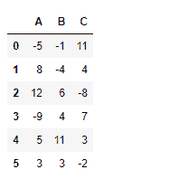
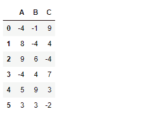
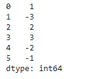
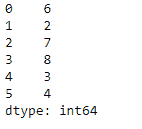
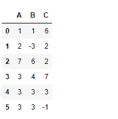

# python | pandas data frame . clip()

> 原文:[https://www.geeksforgeeks.org/python-pandas-dataframe-clip/](https://www.geeksforgeeks.org/python-pandas-dataframe-clip/)

Python 是进行数据分析的优秀语言，主要是因为以数据为中心的 python 包的奇妙生态系统。 ***【熊猫】*** 就是其中一个包，让导入和分析数据变得容易多了。

熊猫 `**dataframe.clip()**`用于在指定的输入阈值下修剪值。我们可以使用这个函数来设置数据框中任何单元格的值的下限和上限。

> **语法:** DataFrame.clip(下=无，上=无，轴=无，在位=假，*参数，* * * kwargs)
> 
> **参数:**
> **下限:**最小阈值。低于此阈值的所有值都将被设置为该值。
> **上限:**最大阈值。高于此阈值的所有值都将被设置为该值。
> **轴:**沿给定轴上下对齐对象。
> **到位:**是否对数据执行到位操作。
> ***args、**kwargs :** 其他关键字没有影响，但可能会被接受以与 numpy 兼容。

**示例#1:** 使用`clip()`功能将数据帧的值修剪到给定阈值以下和以上。

```
# importing pandas as pd
import pandas as pd

# Creating a dataframe using dictionary
df = pd.DataFrame({"A":[-5, 8, 12, -9, 5, 3],
                   "B":[-1, -4, 6, 4, 11, 3],
                   "C":[11, 4, -8, 7, 3, -2]})

# Printing the data frame for visualization
df
```



现在修剪所有低于-4 到-4 的值和所有高于 9 到 9 的值。介于-4 和 9 之间的值保持不变。

```
# Clip in range (-4, 9)
df.clip(-4, 9)
```

**输出:**


请注意，数据帧中没有任何大于 9 且小于-4 的值

**示例#2:** 使用`clip()`功能使用数据帧中每列元素的特定下限和上限阈值进行剪辑。

```
# importing pandas as pd
import pandas as pd

# Creating a dataframe using dictionary

df = pd.DataFrame({"A":[-5, 8, 12, -9, 5, 3],
                   "B":[-1, -4, 6, 4, 11, 3],
                   "C":[11, 4, -8, 7, 3, -2]})

# Printing the dataframe
df
```


当`axis=0`时，该值将跨行被剪裁。我们将为所有列元素提供上限和下限阈值(即相当于行数)

创建一个系列来存储每个列元素的下限和上限阈值。

```
# lower limit for each individual column element.
lower_limit = pd.Series([1, -3, 2, 3, -2, -1])

# upper limit for each individual column element.
upper_limit = lower_limit + 5

# Print lower_limit
lower_limit

# Print upper_limit
upper_limit
```

**输出:**




现在我们想对数据帧应用这些限制。

```
# applying different limit value for each column element
df.clip(lower_limit, upper_limit, axis = 0)
```

**输出:**
