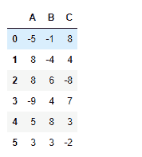
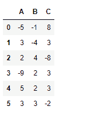

# Python | Pandas data frame . clip _ upper()

> 原文:[https://www . geesforgeks . org/python-pandas-data frame-clip _ upper/](https://www.geeksforgeeks.org/python-pandas-dataframe-clip_upper/)

Python 是进行数据分析的优秀语言，主要是因为以数据为中心的 python 包的奇妙生态系统。 ***【熊猫】*** 就是其中一个包，让导入和分析数据变得容易多了。

熊猫 `**dataframe.clip_upper()**`用于在指定的输入阈值下修剪值。我们使用此函数将输入值阈值以上的所有值修剪为指定的输入值。

> **语法:** DataFrame.clip_upper(阈值，轴=无，在位=假)
> 
> **参数:**
> **阈值:** float 或 array_like
> `float` :将每个值与阈值进行比较。
> `array-like` :阈值的形状应该与它所比较的对象相匹配。当自我是一个系列，阈值应该是长度。当 self 是一个数据帧时，阈值应该是二维的，并且与 self 的形状相同(轴=无)，或者是一维的，并且与被比较的轴的长度相同。
> **轴:**沿给定轴将对象与阈值对齐。
> **到位:**是否对数据执行到位操作。
> 
> **返回:**剪裁:与输入类型相同

**示例#1:** 使用`clip_upper()`功能将数据帧的值修剪到给定阈值以上。

```py
# importing pandas as pd
import pandas as pd

# Creating a dataframe using dictionary
df = pd.DataFrame({"A":[-5, 8, 12, -9, 5, 3],
                   "B":[-1, -4, 6, 4, 11, 3],
                   "C":[11, 4, -8, 7, 3, -2]})

# Printing the data frame for visualization
df
```


现在将 8 到 8 以上的值全部修剪掉。

```py
# Clip all values below 2
df.clip_upper(8)
```

**输出:**


**示例 2:** 使用`clip_upper()`函数将数据帧中的值与数据帧中每个单元格的特定值进行剪辑。

为此，我们可以使用 numpy 数组，但数组的形状必须与数据框的形状相同。

```py
# importing pandas as pd
import pandas as pd

# Creating a dataframe using dictionary

df = pd.DataFrame({"A":[-5, 8, 12, -9, 5, 3], 
                   "B":[-1, -4, 6, 4, 11, 3],
                   "C":[11, 4, -8, 7, 3, -2]})

# upper limit for each individual column element.
limit = np.array([[10, 2, 8], [3, 5, 3], [2, 4, 6],
                  [11, 2, 3], [5, 2, 3], [4, 5, 3]])

# Print upper_limit
limit
```


现在对数据帧应用这些限制。

```py
# applying different limit value
# for each cell in the dataframe
df.clip_upper(limit)
```

**输出:**


每个单元格值都已根据应用的相应上限进行了调整。