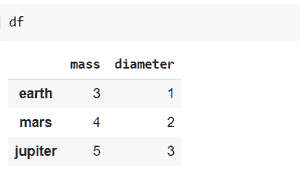
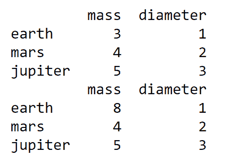
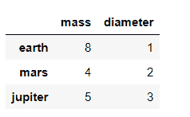

# 蟒蛇熊猫–data frame . copy()功能

> 原文:[https://www . geesforgeks . org/python-pandas-data frame-copy-function/](https://www.geeksforgeeks.org/python-pandas-dataframe-copy-function/)

Python 是进行数据分析的优秀语言，主要是因为以数据为中心的 python 包的奇妙生态系统。Pandas 就是其中之一，它让数据的导入和分析变得更加容易。

在熊猫身上复制数据帧有很多方法。第一种方法是将 dataframe 对象分配给变量的简单方法，但这有一些缺点。

> **语法:**数据帧复制 ( 深度=真 )
> 
> 当 deep=True(默认值)时，将使用调用对象的数据和索引的副本创建一个新对象。对副本的数据或索引的修改不会反映在原始对象中(参见下面的注释)。
> 
> 当 deep=False 时，将创建一个新对象，而不复制调用对象的数据或索引(只复制对数据和索引的引用)。对原始数据的任何更改都将反映在浅拷贝中(反之亦然)。

**步骤** **1)** 让我们首先制作一个虚拟数据帧，我们将使用它来进行说明

**步骤** **2)** 将该数据框对象分配给一个变量

**步骤 3)** 对原始数据帧进行更改，查看复制的变量是否有任何不同

## 蟒蛇 3

```py
import pandas as pd

#Create Series
s = pd.Series([3,4,5],['earth','mars','jupiter'])
k = pd.Series([1,2,3],['earth','mars','jupiter'])

#Create DataFrame df from two series
df = pd.DataFrame({'mass':s,'diameter':k})

df
```

**输出:**



虚拟数据文件 df

现在，让我们将 dataframe df 分配给一个变量并执行更改:

## 蟒蛇 3

```py
#Assign df to variable_copy
variable_copy = df

print(variable_copy) 
#Update the value of mass of earth in original dataframe
df['mass']['earth']=8

print(variable_copy)
```

**输出:**



在这里，我们可以看到，如果我们改变原始数据框中的值，那么复制变量中的数据也会改变。为了克服这个问题，我们使用了 DataFrame.copy()

**让我们看看这个，举例当 deep=True(默认):**

## 蟒蛇 3

```py
res = df.copy(deep=True)
print(res)
```

**输出:**

