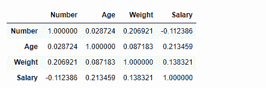
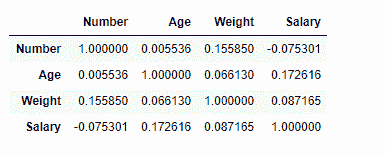

# python | pandas data frame . corr()

> 原文:[https://www.geeksforgeeks.org/python-pandas-dataframe-corr/](https://www.geeksforgeeks.org/python-pandas-dataframe-corr/)

Python 是进行数据分析的优秀语言，主要是因为以数据为中心的 python 包的奇妙生态系统。 ***【熊猫】*** 就是其中一个包，让导入和分析数据变得容易多了。

Pandas `**dataframe.corr()**`用于查找数据帧中所有列的成对相关性。自动排除任何`na`值。对于 dataframe 中的任何非数字数据类型列，它都将被忽略。

> **语法:** DataFrame.corr(self，method='pearson '，min_periods=1)
> 
> **参数:**
> **方法:**
> `pearson` :标准相关系数
> `kendall` :肯德尔τ相关系数
> `spearman` :斯皮尔曼秩相关
> **min_periods :** 每对列获得有效结果所需的最小观测数。目前仅适用于皮尔森和斯皮尔曼相关性
> 
> **返回:**计数:y:数据帧

**注:**一个变量与自身的相关性为 1。

有关代码中使用的 CSV 文件的链接，请单击此处的

**示例#1:** 使用`corr()`函数，使用“皮尔逊”方法查找数据框中各列之间的相关性。

```
# importing pandas as pd
import pandas as pd

# Making data frame from the csv file
df = pd.read_csv("nba.csv")

# Printing the first 10 rows of the data frame for visualization
df[:10]
```


现在使用`corr()`函数找到列之间的相关性。数据框中只有四个数字列。

```
# To find the correlation among
# the columns using pearson method
df.corr(method ='pearson')
```

**输出:**


输出数据帧可以解释为对于任何单元格，行变量与列变量的相关性就是单元格的值。如前所述，变量与其自身的相关性为 1。因此，所有对角线值都是 1.00

**示例#2:** 使用`corr()`函数，使用“肯德尔”方法查找数据框中各列之间的相关性。

```
# importing pandas as pd
import pandas as pd

# Making data frame from the csv file
df = pd.read_csv("nba.csv")

# To find the correlation among
# the columns using kendall method
df.corr(method ='kendall')
```

**输出:**


输出数据帧可以解释为对于任何单元格，行变量与列变量的相关性就是单元格的值。如前所述，变量与其自身的相关性为 1。因此，所有对角线值都是 1.00。