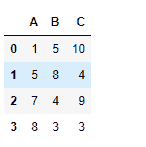
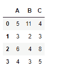
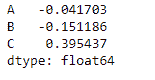
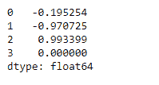

# python | pandas data frame . corrigwith()

> 哎哎哎:# t0]https://www . geeksforgeeks . org/python 熊猫 data frame-corrigwith/

Python 是进行数据分析的优秀语言，主要是因为以数据为中心的 python 包的奇妙生态系统。 [**【熊猫】**](https://www.geeksforgeeks.org/pandas-tutorial/) 就是其中一个包，让导入和分析数据变得容易多了。

熊猫 `**dataframe.corrwith()**`用于计算两个数据框对象的行或列之间的成对相关性。如果两个数据框对象的形状不相同，那么相应的相关值将是`NaN`值。

> **语法:**数据帧计数(轴=0，级别=无，仅数值=假)
> 
> **参数:**
> **其他:**数据框
> **轴:** 0 或“索引”按列计算，1 或“列”按行计算
> **删除:**从结果中删除缺失的索引，默认返回所有的并集
> 
> **返回:**相关:系列

**注:**一个变量与自身的相关性为 1。

**示例#1:** 使用`corrwith()`功能沿**列轴**查找两个数据框对象之间的相关性

```
# importing pandas as pd
import pandas as pd

# Creating the first dataframe
df1 = pd.DataFrame({"A":[1, 5, 7, 8], 
                    "B":[5, 8, 4, 3],
                    "C":[10, 4, 9, 3]})

# Creating the second dataframe 
df2 = pd.DataFrame({"A":[5, 3, 6, 4],
                    "B":[11, 2, 4, 3],
                    "C":[4, 3, 8, 5]})

# Print the first dataframe
print(df1, "\n")

# Print the second dataframe
print(df2)
```




现在沿着行轴找出两个数据帧的列之间的相关性。

```
# To find the correlation among the
# columns of df1 and df2 along the column axis
df1.corrwith(df2, axis = 0)
```

**输出:**

输出序列分别包含两个数据框对象的三列之间的相关性。

**示例 2:** 使用`corrwith()`功能沿**行轴**查找两个数据框对象之间的相关性

```
# importing pandas as pd
import pandas as pd

# Creating the first dataframe
df1 = pd.DataFrame({"A":[1, 5, 7, 8],
                    "B":[5, 8, 4, 3],
                    "C":[10, 4, 9, 3]})

# Creating the second dataframe 
df2 = pd.DataFrame({"A":[5, 3, 6, 4],
                    "B":[11, 2, 4, 3], 
                    "C":[4, 3, 8, 5]})

# To find the correlation among the
# columns of df1 and df2 along the row axis
df1.corrwith(df2, axis = 1)
```

**输出:**


输出系列分别包含两个数据框对象的四行之间的相关性。