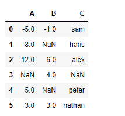
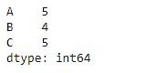
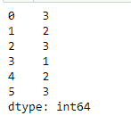

# Python | Pandas data frame . count()

> 原文:[https://www . geesforgeks . org/python-pandas-data frame-count/](https://www.geeksforgeeks.org/python-pandas-dataframe-count/)

Python 是进行数据分析的优秀语言，主要是因为以数据为中心的 python 包的奇妙生态系统。 ***【熊猫】*** 就是其中一个包，让导入和分析数据变得容易多了。

熊猫 `**dataframe.count()**`用于计算给定轴上非 NA/null 观测值的数量。它也可以处理非浮动类型的数据。

> **语法:**数据帧计数(轴=0，级别=无，仅数值=假)
> 
> **参数:**
> **轴:** 0 或“索引”代表行，1 或“列”代表列
> **级别:**如果轴是多索引(分层)，沿特定级别计数，折叠成数据框
> **numeric_only :** 仅包括浮点、int、布尔数据
> 
> **返回:**计数:序列(或数据帧，如果指定了级别)

**示例#1:** 使用`count()`函数查找行轴上非 NA/null 值的数量。

```
# importing pandas as pd
import pandas as pd

# Creating a dataframe using dictionary
df = pd.DataFrame({"A":[-5, 8, 12, None, 5, 3], 
                   "B":[-1, None, 6, 4, None, 3],
                   "C:["sam", "haris", "alex", np.nan, "peter", "nathan"]})

# Printing the dataframe
df
```



现在，请找出行轴上非数值的计数

```
# axis = 0 indicates row
df.count(axis = 0)
```

**输出:**


**例 2:** 使用`count()`函数查找跨列的非 NA/null 值的个数。

```
# importing pandas as pd
import pandas as pd

# Creating a dataframe using dictionary
df = pd.DataFrame({"A":[-5, 8, 12, None, 5, 3],
                   "B":[-1, None, 6, 4, None, 3], 
                   "C:["sam", "haris", "alex", np.nan, "peter", "nathan"]})

# Find count of non-NA across the columns
df.count(axis = 1)
```

**输出:**
