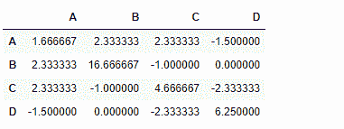
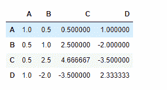

# python | pandas data frame . cov()

> 哎哎哎:# t0]https://www . geeksforgeeks . org/python 熊猫 data frame-cov/

Python 是进行数据分析的优秀语言，主要是因为以数据为中心的 python 包的奇妙生态系统。 ***【熊猫】*** 就是其中一个包，让导入和分析数据变得容易多了。

熊猫 `**dataframe.cov()**`用于**计算列**的成对协方差。
如果一列中的某些单元格包含`NaN`值，则忽略该值。

> **语法:**data frame . cov(min _ periods =无)
> 
> **参数:**
> **min_periods :** 每对列获得有效结果所需的最小观察次数。
> 
> **返回:** y:数据帧

**示例#1:** 使用`cov()`函数找到数据帧各列之间的协方差。

**注意:**任何非数字列将被忽略。

```py
# importing pandas as pd
import pandas as pd

# Creating the dataframe
df = pd.DataFrame({"A":[5, 3, 6, 4], 
                   "B":[11, 2, 4, 3],
                   "C":[4, 3, 8, 5],
                   "D":[5, 4, 2, 8]})

# Print the dataframe
df
```

**输出:**


现在找到数据框各列之间的协方差

```py
# To find the covariance 
df.cov()
```

**输出:**


**示例#2:** 使用`cov()`函数查找具有`NaN`值的数据帧的列之间的协方差。

```py
# importing pandas as pd
import pandas as pd

# Creating the dataframe
df = pd.DataFrame({"A":[5, 3, None, 4],
                   "B":[None, 2, 4, 3],
                   "C":[4, 3, 8, 5], 
                   "D":[5, 4, 2, None]})

# To find the covariance 
df.cov()
```

**输出:**
