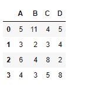
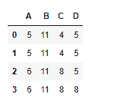
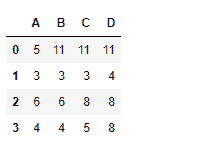
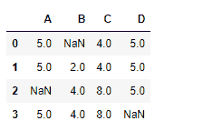

# python | pandas data frame . cumax()

> 原文:[https://www . geesforgeks . org/python-pandas-data frame-cum max/](https://www.geeksforgeeks.org/python-pandas-dataframe-cummax/)

Python 是进行数据分析的优秀语言，主要是因为以数据为中心的 python 包的奇妙生态系统。 ***【熊猫】*** 就是其中一个包，让导入和分析数据变得容易多了。

熊猫 `**dataframe.cummax()**`用于**求任意轴上的累计最大值。**每个单元格都填充了迄今为止看到的最大值。

> **语法:** DataFrame.cummax(轴=无，skipna =真，*参数，* * * kwargs)
> 
> **参数:**
> **轴:**{索引(0)，列(1)}
> **skipna :** 排除 NA/null 值。如果整行/整列为“无”，结果将为“无”
> 
> **返回:**最大值:系列

**示例#1:** 使用`cummax()`功能，沿指数轴查找累计最大值。

```
# importing pandas as pd
import pandas as pd

# Creating the dataframe
df = pd.DataFrame({"A":[5, 3, 6, 4],
                   "B":[11, 2, 4, 3],
                   "C":[4, 3, 8, 5], 
                   "D":[5, 4, 2, 8]})

# Print the dataframe
df
```

**输出:**


现在找到索引轴上的累积最大值

```
# To find the cumulative max
df.cummax(axis = 0)
```

**输出:**


**例 2:** 使用`cummax()`函数，沿列轴查找累计最大值。

```
# importing pandas as pd
import pandas as pd

# Creating the dataframe
df = pd.DataFrame({"A":[5, 3, 6, 4],
                   "B":[11, 2, 4, 3],
                   "C":[4, 3, 8, 5], 
                   "D":[5, 4, 2, 8]})

# To find the cumulative max along column axis
df.cummax(axis = 1)
```

**输出:**


**示例#3:** 使用`cummax()`函数在具有`NaN`值的数据框中，沿索引轴查找累积最大值。

```
# importing pandas as pd
import pandas as pd

# Creating the dataframe
df = pd.DataFrame({"A":[5, 3, None, 4],
                   "B":[None, 2, 4, 3],
                   "C":[4, 3, 8, 5], 
                   "D":[5, 4, 2, None]})

# To find the cumulative max
df.cummax(axis = 0, skipna = True)
```

**输出:**
