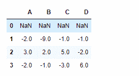
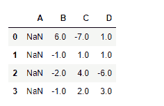

# python | pandas data frame . diff()

> 哎哎哎:# t0]https://www . geeksforgeeks . org/python 熊猫 dataframe-diff/

Python 是进行数据分析的优秀语言，主要是因为以数据为中心的 python 包的奇妙生态系统。 ***【熊猫】*** 就是其中一个包，让导入和分析数据变得容易多了。

熊猫 `**dataframe.diff()**`用于寻找给定轴上物体的第一个离散差。我们可以提供一个周期值来移动形成差异。

> **语法:** DataFrame.diff(周期=1，轴=0)
> 
> **参数:**
> **周期:**周期移位形成差异
> **轴:**取行(0)或列(1)的差异。
> 
> **返回:**不同:数据帧

**示例#1:** 使用`diff()`函数查找周期值等于 1 的指数轴上的离散差值。

```
# importing pandas as pd
import pandas as pd

# Creating the dataframe
df = pd.DataFrame({"A":[5, 3, 6, 4],
                   "B":[11, 2, 4, 3], 
                   "C":[4, 3, 8, 5],
                   "D":[5, 4, 2, 8]})

# Print the dataframe
df
```


现在找到指数轴上的离散差。

```
# To find the discrete difference
df.diff(axis = 0, periods = 1)
```

**输出:**


输出是一个数据帧，其单元格包含索引轴上的离散差异。每个单元格中的值是当前单元格值与前一行对应单元格的差值。注意，第一行是`NaN`填充的。这是因为上面没有一行可以找到区别，所以被视为`NaN`。

**例 2:** 使用`diff()`函数求周期值等于 1 的列轴上的离散差。

```
# importing pandas as pd
import pandas as pd

# Creating the dataframe
df = pd.DataFrame({"A":[5, 3, 6, 4],
                   "B":[11, 2, 4, 3], 
                   "C":[4, 3, 8, 5], 
                   "D":[5, 4, 2, 8]})

# To find the discrete difference
df.diff(axis = 1, periods = 1)
```

**输出:**


输出是一个数据帧，其单元格包含列轴上的离散差异。每个单元格中的值是当前单元格值与前一列对应单元格的差值。注意，第一列是`NaN`填充。这是因为它的左边没有列可以找到区别，所以它被视为`NaN`。