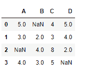
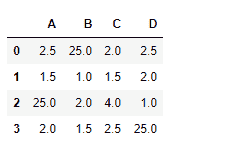

# python | pandas data frame . div()

> 哎哎哎:# t0]https://www . geeksforgeeks . org/python 熊猫 dataframe-div/

Python 是进行数据分析的优秀语言，主要是因为以数据为中心的 python 包的奇妙生态系统。 ***【熊猫】*** 就是其中一个包，让导入和分析数据变得容易多了。
Pandas**data frame . div()**用于查找数据帧的浮动分区和其他元素。该函数类似于 dataframe/other，但额外支持处理一个输入数据中的缺失值。

> **语法:** DataFrame.div(其他，轴='columns '，level=None，fill_value=None)
> **参数:**
> **其他:** Series，DataFrame，或常量
> **轴:**对于 Series 输入，轴要与
> **上的 Series 索引匹配 fill_value :** 用该值填充缺失(NaN)值。如果两个数据帧位置都丢失，结果将丢失
> **级别:**跨级别广播，匹配传递的多索引级别上的索引值
> **返回:**结果:数据帧

**示例#1:** 使用 div()函数查找具有常数值的数据框元素的浮动除法。还要处理 dataframe 中存在的 NaN 值。

## 蟒蛇 3

```
# importing pandas as pd
import pandas as pd

# Creating the dataframe with NaN value
df = pd.DataFrame({"A":[5, 3, None, 4],
                   "B":[None, 2, 4, 3],
                   "C":[4, 3, 8, 5],
                   "D":[5, 4, 2, None]})

# Print the dataframe
df
```



现在用 2
找到每个数据帧元素的划分

## 蟒蛇 3

```
# Find the division with 50 being substituted
# for all the missing values in the dataframe
df.div(2, fill_value = 50)
```

**输出:**



输出是一个数据帧，其单元格包含每个单元格值除以 2 的结果。在进行分裂之前，所有的 NaN 细胞都已经充满了 50 个。

**示例#2:** 使用 div()函数查找索引轴上带有序列对象的数据帧的浮动部分。

## 蟒蛇 3

```
# importing pandas as pd
import pandas as pd

# Creating the dataframe
df = pd.DataFrame({"A":[5, 3, 6, 4],
                   "B":[11, 2, 4, 3],
                   "C":[4, 3, 8, 5],
                   "D":[5, 4, 2, 8]})

# Create a series object with no. of elements
# equal to the element along the index axis.

# Creating a pandas series object
series_object = pd.Series([2, 3, 1.5, 4])

# Print the series_obejct
series_object
```