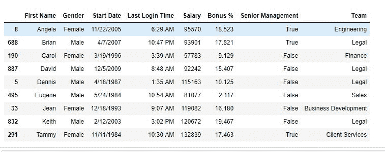
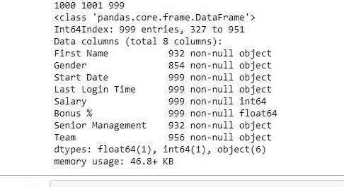

# Python | Pandas data frame . drop _ duplicates()

> 原文:[https://www . geesforgeks . org/python-pandas-data frame-drop _ duplicates/](https://www.geeksforgeeks.org/python-pandas-dataframe-drop_duplicates/)

Python 是进行数据分析的优秀语言，主要是因为以数据为中心的 python 包的奇妙生态系统。 ***【熊猫】*** 就是其中一个包，让导入和分析数据变得容易多了。
数据分析的一个重要部分是分析重复值并删除它们。Pandas **drop_duplicates()** 方法有助于从数据帧中删除重复项。

> **语法:** DataFrame.drop_duplicates(子集=无，keep='first '，inplace=False)
> **参数:**
> **子集:**子集取列或列标签列表。它的默认值是无。在传递列后，它将只考虑重复的列。
> **keep:** keep 是控制如何考虑重复值。它只有三个不同的值，默认值是“第一”。
> 
> *   如果为“第一”，则认为第一个值是唯一的，其余相同的值是重复的。
> *   如果为“最后”，则认为最后一个值是唯一的，其余相同的值是重复的。
> *   如果为假，则认为所有相同的值都是重复的
> 
> **就地:**布尔值，如果为真，则删除重复的行。
> **返回类型:**根据传递的参数删除重复行的数据帧。

要下载使用的 CSV 文件，点击这里[。](https://media.geeksforgeeks.org/wp-content/uploads/employees.csv)

**示例#1:** 删除具有相同名字的行
在以下示例中，删除具有相同名字的行，并返回新的数据框。

## 计算机编程语言

```py
# importing pandas package
import pandas as pd

# making data frame from csv file
data = pd.read_csv("employees.csv")

# sorting by first name
data.sort_values("First Name", inplace = True)

# dropping ALL duplicate values
data.drop_duplicates(subset ="First Name",
                     keep = False, inplace = True)

# displaying data
data
```

**输出:**
如图，从数据框中删除同名行。



**示例#2:** 删除具有所有重复值的行
在此示例中，将删除具有所有值的行。因为 csv 文件没有这样的行，所以会复制一个随机行，并首先插入到数据框中。

## 计算机编程语言

```py
#importing pandas package
import pandas as pd

# making data frame from csv file
data = pd.read_csv("employees.csv")

#length before adding row
length1 = len(data)

# manually inserting duplicate of a row of row 440
data.loc[1001] = [data["First Name"][440],
                  data["Gender"][440],
                  data["Start Date"][440],
                  data["Last Login Time"][440],
                  data["Salary"][440],
                  data["Bonus %"][440],
                  data["Senior Management"][440],
                  data["Team"][440]]

# length after adding row
length2=  len(data)

# sorting by first name
data.sort_values("First Name", inplace=True)

# dropping duplicate values
data.drop_duplicates(keep=False,inplace=True)

# length after removing duplicates
length3=len(data)

# printing all data frame lengths
print(length1, length2, length3)
```

**输出:**
如输出图所示，去重后长度为 999。由于 keep 参数设置为 False，所有重复的行都被删除。

