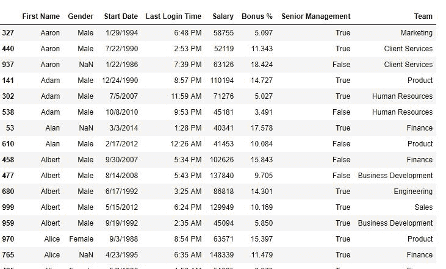
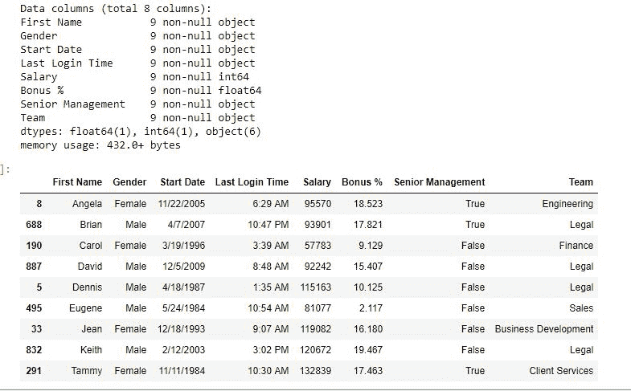

# Python | Pandas data frame . duplicated()

> 原文:[https://www . geesforgeks . org/python-pandas-data frame-replicated/](https://www.geeksforgeeks.org/python-pandas-dataframe-duplicated/)

Python 是进行数据分析的优秀语言，主要是因为以数据为中心的 python 包的奇妙生态系统。 ***【熊猫】*** 就是其中一个包，让导入和分析数据变得容易多了。
数据分析的一个重要部分是分析*重复值*并将其删除。熊猫**重复()**方法仅帮助分析重复值。它返回一个布尔序列，该序列仅对唯一元素为真。
**语法:**

```
DataFrame.duplicated(subset=None, keep='first')
```

**参数:**

> **子集:**取列或列标签列表。它的默认值是无。在传递列后，它将只考虑重复的列。
> **keep:** 控制如何考虑重复值。它只有三个不同的值，默认值是“第一”。
> **–>**如果为“第一”，则认为第一个值是唯一的，其余相同的值是重复的。
> **–>**如果为“最后”，则认为最后一个值是唯一的，其余相同的值是重复的。
> **–>**如果为假，则认为所有相同的值都是重复的。

要下载使用的 CSV 文件，点击这里[。](https://media.geeksforgeeks.org/wp-content/uploads/employees.csv)
**示例#1:** 返回布尔序列
在以下示例中，基于“名字”列中的重复值返回布尔序列。

## 计算机编程语言

```
# importing pandas package
import pandas as pd

# making data frame from csv file
data = pd.read_csv("employees.csv")

# sorting by first name
data.sort_values("First Name", inplace = True)

# making a bool series
bool_series = data["First Name"].duplicated()

# displaying data
data.head()

# display data
data[bool_series]
```

**输出:**
如输出图像所示，由于 keep 参数默认为“第一”，因此每当出现名称时，第一个被认为是唯一的，而 res 是重复的。



**示例#2:** 删除重复项
在此示例中，keep 参数设置为 False，因此仅获取唯一值，并从数据中删除重复值。

## 计算机编程语言

```
# importing pandas package
import pandas as pd

# making data frame from csv file
data = pd.read_csv("employees.csv")

# sorting by first name
data.sort_values("First Name", inplace = True)

# making a bool series
bool_series = data["First Name"].duplicated(keep = False)

# bool series
bool_series

# passing NOT of bool series to see unique values only
data = data[~bool_series]

# displaying data
data.info()
data
```

**输出:**
由于 duplicated()方法对于 Duplicates 返回 False，因此取该系列的“非”以查看数据框中的唯一值。

