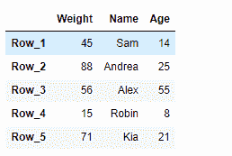
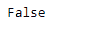
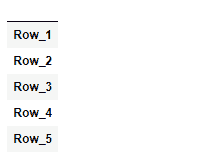
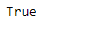

# Python | Pandas data frame . empty

> 原文:[https://www . geesforgeks . org/python-pandas-data frame-empty/](https://www.geeksforgeeks.org/python-pandas-dataframe-empty/)

Pandas DataFrame 是一个二维可变大小、潜在异构的表格数据结构，带有标记轴(行和列)。算术运算在行标签和列标签上对齐。它可以被认为是系列对象的类似字典的容器。这是熊猫的主要数据结构。

熊猫 `**DataFrame.empty**`属性检查数据框是否为空。如果数据框为空，则返回`True`，否则返回`False`。

> **语法:**数据框。空
> 
> **参数:**无
> 
> **返回:** bool

**示例#1:** 使用`DataFrame.empty`属性检查给定的数据帧是否为空。

```
# importing pandas as pd
import pandas as pd

# Creating the DataFrame
df = pd.DataFrame({'Weight':[45, 88, 56, 15, 71],
                   'Name':['Sam', 'Andrea', 'Alex', 'Robin', 'Kia'],
                   'Age':[14, 25, 55, 8, 21]})

# Create the index
index_ = ['Row_1', 'Row_2', 'Row_3', 'Row_4', 'Row_5']

# Set the index
df.index = index_

# Print the DataFrame
print(df)
```

**输出:**


现在我们将使用`DataFrame.empty`属性来检查给定的数据帧是否为空。

```
# check if there is any element
# in the given dataframe or not
result = df.empty

# Print the result
print(result)
```

**输出:**

正如我们在输出中看到的，`DataFrame.empty`属性返回了`False`，表示给定的数据帧不是空的。

**示例 2:** 使用`DataFrame.empty`属性检查给定的数据帧是否为空。

```
# importing pandas as pd
import pandas as pd

# Creating an empty DataFrame
df = pd.DataFrame(index = ['Row_1', 'Row_2', 'Row_3', 'Row_4', 'Row_5'])

# Print the DataFrame
print(df)
```

**输出:**


现在我们将使用`DataFrame.empty`属性来检查给定的数据帧是否为空。

```
# check if there is any element
# in the given dataframe or not
result = df.empty

# Print the result
print(result)
```

**输出:**

正如我们在输出中看到的，`DataFrame.empty`属性返回了`True`，表示给定的数据帧为空。