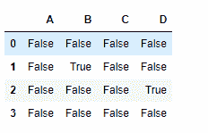
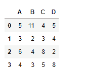
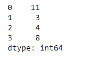
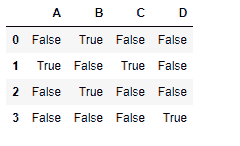

# python | pandas data frame . eq()

> 哎哎哎:# t0]https://www . geeksforgeeks . org/python-pandas data frame-eq/

Python 是进行数据分析的优秀语言，主要是因为以数据为中心的 python 包的奇妙生态系统。 ***【熊猫】*** 就是其中一个包，让导入和分析数据变得容易多了。

熊猫 `**dataframe.eq()**`是用于灵活比较的包装。它提供了一种将 dataframe 对象与常量、序列或其他 dataframe 对象进行比较的便捷方法。

> **语法:** DataFrame.eq(其他，轴= '列'，级别=无)
> 
> **参数:**
> **其他:**系列、数据框或常量
> **轴:** {0，1，【索引】【列】}
> **级别:**默认无
> 
> **返回:**结果:包含布尔值的数据帧

**示例#1:** 使用`eq()`函数查找数据框和常数之间的比较结果。

```
# importing pandas as pd
import pandas as pd

# Creating the dataframe with NaN value
df = pd.DataFrame({"A":[5, 3, None, 4],
                   "B":[None, 2, 4, 3],
                   "C":[4, 3, 8, 5],
                   "D":[5, 4, 2, None]})

# Print the dataframe
df
```


现在找到 dataframe 元素与值 2 的比较。

```
# To find the comparison result
df.eq(2)
```

**输出:**


输出是包含比较结果的单元格的数据帧。True 值表示单元格值等于比较值，False 值表示正在比较的值不相等。请注意，缺失值是如何被评估为假的。如果我们使用等式运算符比较两个`NaN`，那么结果将是假的。

**示例 2:** 使用`eq()`函数测试数据框对象和序列对象之间的相等性

```
# importing pandas as pd
import pandas as pd

# Creating the dataframe 
df = pd.DataFrame({"A":[5, 3, 6, 4],
                   "B":[11, 2, 4, 3],
                   "C":[4, 3, 8, 5],
                   "D":[5, 4, 2, 8]})

# Print the dataframe
df
```



现在创建一个系列对象，其元素数量等于索引轴上的元素数量。

**注意:**如果数据框和系列对象的索引轴的尺寸不相同，则会出现错误。

```
# Creating a pandas series object
series_object = pd.Series([11, 3, 4, 8])

# Print the series_obejct
series_object
```



现在，沿着索引轴查找 dataframe 对象和 series 对象之间的比较。系列的尺寸和用于比较的数据框轴应该相同。

```
# To find the comparison between 
# dataframe and the series object.
df.eq(series_object, axis = 0)
```

**输出:**

输出是一个数据帧，其单元格包含当前单元格元素与相应系列对象单元格的比较结果。