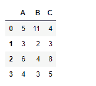
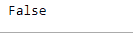
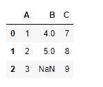
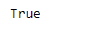

# Python | Pandas data frame . equals()

> 原文:[https://www . geesforgeks . org/python-pandas-data frame-equals/](https://www.geeksforgeeks.org/python-pandas-dataframe-equals/)

Python 是进行数据分析的优秀语言，主要是因为以数据为中心的 python 包的奇妙生态系统。 ***【熊猫】*** 就是其中一个包，让导入和分析数据变得容易多了。

熊猫 `**dataframe.equals()**`功能用于确定所考虑的两个数据帧对象是否相等。与`dataframe.eq()`方法不同，运算的结果是一个标量布尔值，指示数据框对象是否相等。

> **语法:** DataFrame.equals(其他)
> 
> **参数:**
> **其他:**数据框
> 
> **返回:**标量:布尔值

**示例#1:** 使用`equals()`函数查找两个不同数据框对象之间的比较结果。

```py
# importing pandas as pd
import pandas as pd

# Creating the first dataframe 
df1 = pd.DataFrame({"A":[1,5,7,8],
                  "B":[5,8,4,3],
                  "C":[10,4,9,3]})

# Creating the second dataframe
df2 = pd.DataFrame({"A":[5,3,6,4],
                  "B":[11,2,4,3],
                  "C":[4,3,8,5]})

# Print the first dataframe
df1

# Print the second dataframe
df2
```




让我们找出两个数据帧之间的比较结果。

```py
# To find the comparison result
df1.equals(df2)
```

**输出:**



输出为假，因为两个数据帧不相等。它们有不同的元素。

**示例 2:** 使用`equals()`函数测试两个数据框对象之间的相等性，值为`NaN`。
**注:**同一位置的 NaNs 视为相等。

```py
# importing pandas as pd
import pandas as pd

# Creating the first dataframe
df1 = pd.DataFrame({"A":[1,2,3],
                  "B":[4,5,None],
                  "C":[7,8,9]})

# Creating the second dataframe
df2 = pd.DataFrame({"A":[1,2,3],
                  "B":[4,5,None],
                  "C":[7,8,9]})

# Print the first dataframe
df1

# Print the second dataframe
df2
```




让我们对两个数据帧执行比较操作。

```py
# To find the comparison between two dataframes
df1.equals(df2)
```

**输出:**



输出标量布尔值。True 表示两个数据框在相应的单元格中具有相等的值。