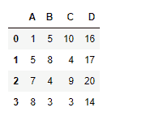
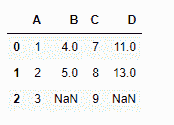

# python | pandas data frame . eval()

> 哎哎哎:# t0]https://www . geeksforgeeks . org/python 熊猫 data frame-eval/

Python 是进行数据分析的优秀语言，主要是因为以数据为中心的 python 包的奇妙生态系统。 ***【熊猫】*** 就是其中一个包，让导入和分析数据变得容易多了。

熊猫 `**dataframe.eval()**`函数用于在调用 dataframe 实例的上下文中计算表达式。表达式在数据框的列上计算。

> **语法:** DataFrame.eval(expr，inplace=false，**kwargs)
> 
> **参数:**
> **表达式:**要求值的表达式字符串。
> **在位:**如果表达式包含赋值，是否在位执行操作并变异现有的 DataFrame。否则，返回新的
> 数据帧。
> **kwargs :** 有关查询()接受的关键字参数的完整详细信息，请参见 eval()的文档。
> 
> **返回:**ret:n 数组、标量或熊猫对象

**示例#1:** 使用`eval()`函数计算数据框中所有列元素的总和，并将结果列插入数据框中。

```
# importing pandas as pd
import pandas as pd

# Creating the dataframe 
df=pd.DataFrame({"A":[1,5,7,8],
                 "B":[5,8,4,3],
                 "C":[10,4,9,3]})

# Print the first dataframe
df
```


让我们计算所有列的总和，并将结果列添加到数据框中

```
# To evaluate the sum over all the columns
df.eval('D = A + B+C', inplace = True)

# Print the modified dataframe
df
```

**输出:**



**示例 2:** 使用`eval()`函数计算数据框中任意两个列元素的总和，并将结果列插入数据框中。数据框有`NaN`值。

**注意:**任何表达式都不能超过`NaN`值。所以对应的细胞也会是`NaN`。

```
# importing pandas as pd
import pandas as pd

# Creating the dataframe
df=pd.DataFrame({"A":[1,2,3],
                 "B":[4,5,None],
                 "C":[7,8,9]})

# Print the dataframe
df
```


我们来评估一下“B”列和“C”列的总和。

```
# To evaluate the sum of two columns in the dataframe
df.eval('D = B + C', inplace = True)

# Print the modified dataframe
df
```

**输出:**


请注意，结果列“D”的最后一行中有`NaN`值，因为评估中使用的相应单元格是`NaN`单元格。