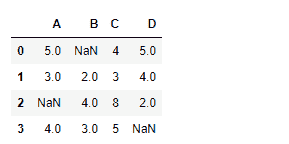
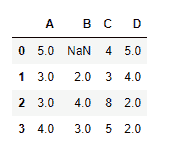
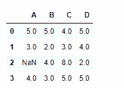

# Python | Pandas data frame . ffill()

> 原文:[https://www . geesforgeks . org/python-pandas-data frame-ffill/](https://www.geeksforgeeks.org/python-pandas-dataframe-ffill/)

Python 是进行数据分析的优秀语言，主要是因为以数据为中心的 python 包的奇妙生态系统。 ***【熊猫】*** 就是其中一个包，让导入和分析数据变得容易多了。
熊猫 **dataframe.ffill()** 函数用于填充数据帧中缺失的值。“ffill”代表“向前填充”,并将向前传播最后一个有效观察值。

> **语法:** DataFrame.ffill(轴=无，inplace=False，limit =无，downcast =无)
> **参数:**
> **轴:** {0，index 1，column}
> **inplace :** 如果为真，则填写到位。注意:这将修改此对象上的任何其他视图(例如，数据框中某列的无拷贝切片)。
> **限制:**如果指定了方法，这是向前/向后填充的连续 NaN 值的最大数量。换句话说，如果有一个超过这个数量的连续 nan 的间隙，它将只被部分填充。如果未指定方法，这是沿整个轴将填充 NaNs 的最大条目数。如果不是“无”，则必须大于 0。
> **向下转换:**项的字典- >如果可能，向下转换什么的数据类型，或者尝试向下转换为适当的相等类型(例如，如果可能，从 64 到 64)的字符串“推断”
> **返回:**填充:数据帧

**示例#1:** 使用 ffill()函数沿索引轴填充缺失值。
**注意:**当在索引中应用 ffill()时，任何缺失的值都将根据上一行中的相应值进行填充。

## 蟒蛇 3

```
# importing pandas as pd
import pandas as pd

# Creating the dataframe
df=pd.DataFrame({"A":[5,3,None,4],
                 "B":[None,2,4,3],
                 "C":[4,3,8,5],
                 "D":[5,4,2,None]})

# Print the dataframe
df
```



让我们填充索引轴上缺失的值

## 蟒蛇 3

```
# applying ffill() method to fill the missing values
df.ffill(axis = 0)
```

**输出:**



请注意，第一行中的值仍然是 NaN 值，因为上面没有可以传播非 NAn 值的行。

**示例#2:** 使用 ffill()函数沿列轴填充缺失值。
**注意:**当在列轴上应用 ffill 时，缺少的值将由同一行中上一列的值填充。

## 蟒蛇 3

```
# importing pandas as pd
import pandas as pd

# Creating the dataframe
df=pd.DataFrame({"A":[5,3,None,4],
                 "B":[None,2,4,3],
                 "C":[4,3,8,5],
                 "D":[5,4,2,None]})

# Print the dataframe
df
```


让我们填充列轴上缺失的值

## 蟒蛇 3

```
# applying ffill() method to fill the missing values
df.ffill(axis = 1)
```

**输出:**



请注意，第一列中的值是 NaN 值，因为没有剩余的单元格，所以无法使用列轴上的前一个单元格值填充该单元格。