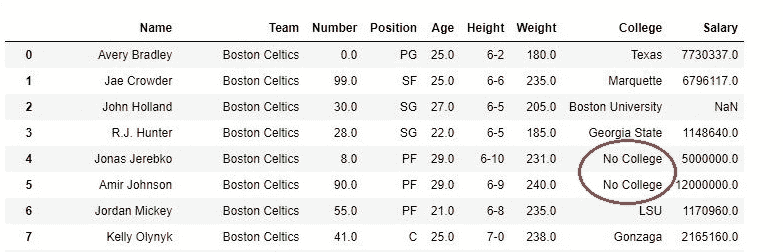
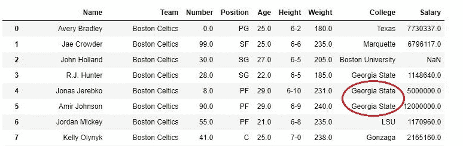
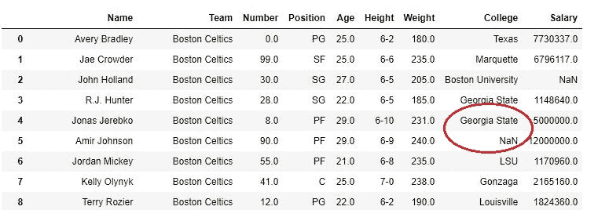

# Python | Pandas DataFrame . fillna()替换 data frame 中的 Null 值

> 原文:[https://www . geesforgeks . org/python-pandas-data frame-fill na-to-replace-null-values-in-data frame/](https://www.geeksforgeeks.org/python-pandas-dataframe-fillna-to-replace-null-values-in-dataframe/)

Python 是进行数据分析的优秀语言，主要是因为以数据为中心的 Python 包的奇妙生态系统。 ***【熊猫】*** 就是其中一个包，让导入和分析数据变得容易多了。

有时 csv 文件有空值，这些值后来在数据框中显示为 *NaN* 。就像 pandas `dropna()`方法管理和移除数据帧中的 Null 值一样，`fillna()`管理并让用户用自己的值替换 NaN 值。

**语法:**

> DataFrame.fillna(值=无，方法=无，轴=无，位置=假，限制=无，向下转换=无，**kwargs)

**参数:**

> **值:**要填充的静态、字典、数组、序列或数据框，而不是 NaN。
> **方法:如果用户没有传递任何值，则使用**方法。熊猫有不同的方法，如`bfill`、`backfill` 或`ffill` ，分别在前进索引或上一个/后退中填入值。
> **轴:**轴取行/列的 int 或 string 值。整数的输入可以是 0 或 1，字符串
> **的输入可以是“索引”或“列”:**是一个布尔值，如果为真，则更改数据框本身。
> **限制:**这是一个整数值，指定连续向前/向后 NaN 值填充的最大数量。
> **向下转换:**它需要一个字典来指定将哪个数据类型向下转换为哪个数据类型。就像 Float64 到 int64。
> *** *夸格斯:**任何其他关键字参数

有关代码中使用的 CSV 文件的链接，请单击此处的。

**示例#1:** 用静态值替换 NaN 值。

**更换前:**

```
# importing pandas module
import pandas as pd

# making data frame from csv file
nba = pd.read_csv("nba.csv")

nba
```

**输出:**


**替换后:**
在下面的示例中，“学院”列中的所有空值都被替换为“无学院”字符串。首先从 CSV 导入数据框，然后选择学院列并对其使用 `fillna()`方法。

```
# importing pandas module
import pandas as pd

# making data frame from csv file
nba = pd.read_csv("nba.csv")

# replacing na values in college with No college
nba["College"].fillna("No College", inplace = True)

nba
```

**输出:**


**示例#2:** 使用方法参数

在以下示例中，方法被设置为 *ffill* ，因此同一列中的值将替换空值。在这种情况下*佐治亚州*在第 4 行和第 5 行的学院列中替换了空值。
同样，也可以使用填充、回填和垫料方法。

```
# importing pandas module
import pandas as pd

# making data frame from csv file
nba = pd.read_csv("nba.csv")

# replacing na values in college with No college
nba["College"].fillna( method ='ffill', inplace = True)

nba
```

**输出:**


**示例#3:** 使用限制

在本例中，在 *fillna()* 方法中设置了 1 的限制，以检查在一次成功替换 NaN 值后功能是否停止替换。

```
# importing pandas module
import pandas as pd

# making data frame from csv file
nba = pd.read_csv("nba.csv")

# replacing na values in college with No college
nba["College"].fillna( method ='ffill', limit = 1, inplace = True)

nba
```

**输出:**
如输出所示，第 4 行的学院列被替换，但第 5 列没有，因为限制设置为 1。
