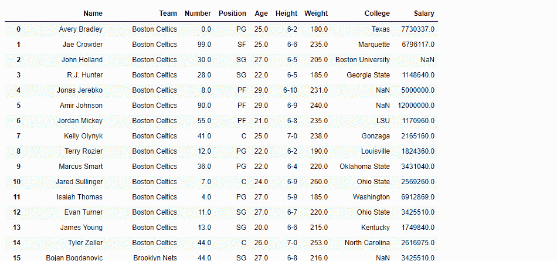
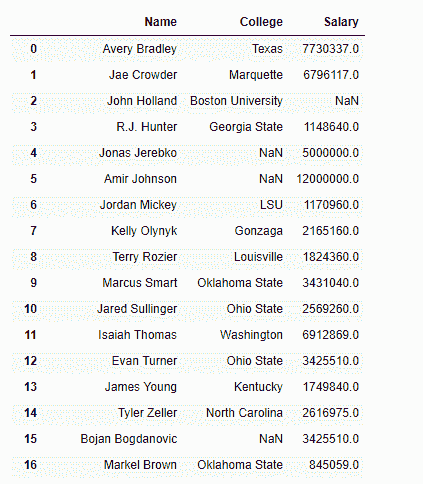
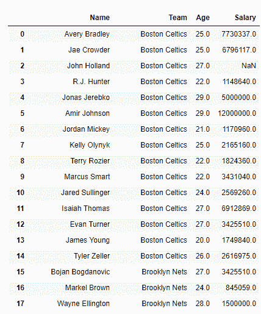

# Python | Pandas data frame . filter()

> 原文:[https://www . geesforgeks . org/python-pandas-data frame-filter/](https://www.geeksforgeeks.org/python-pandas-dataframe-filter/)

Python 是进行数据分析的优秀语言，主要是因为以数据为中心的 python 包的奇妙生态系统。 ***【熊猫】*** 就是其中一个包，让导入和分析数据变得容易多了。

熊猫 `**dataframe.filter()**`功能用于根据指定索引中的标签对数据帧的行或列进行子集化。请注意，该例程不会对数据帧的内容进行过滤。筛选器应用于索引的标签。

> **语法:**数据框过滤器(项=无，像=无，正则表达式=无，轴=无)
> 
> **参数:**
> **项目:**要限制的信息轴列表(不得全部存在)
> **类似:**保留信息轴，其中“arg in col = = True”
> **正则表达式:**保留带有 re.search 的信息轴(正则表达式，col) == True
> **轴:**要过滤的轴。默认情况下，这是信息轴，“系列”的“索引”，数据框的“列”
> 
> **返回:**与输入对象类型相同

像和 regex 参数这样的项被强制为互斥的。axis 默认为使用[]索引时使用的信息轴。

关于 CSV 文件的链接，请点击这里的

**示例#1:** 使用`filter()`功能过滤掉数据框的任意三列。

```
# importing pandas as pd
import pandas as pd

# Creating the dataframe 
df = pd.read_csv("nba.csv")

# Print the dataframe
df
```



现在过滤“姓名”、“学院”和“工资”列。

```
# applying filter function 
df.filter(["Name", "College", "Salary"])
```

**输出:**


**示例 2:** 使用`filter()`函数对名称中包含字母“A”或“A”的数据框中的所有列进行子集化。

**注意:** `filter()`函数也将正则表达式作为其参数之一。

```
# importing pandas as pd
import pandas as pd

# Creating the dataframe 
df = pd.read_csv("nba.csv")

# Using regular expression to extract all
# columns which has letter 'a' or 'A' in its name.
df.filter(regex ='[aA]')
```

**输出:**


正则表达式“[aA]”查找名称中有“A”或“A”的所有列名。