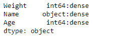
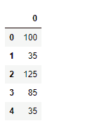
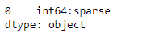

# python | pandas data frame . fttypes

> 哎哎哎:# t0]https://www . geeksforgeeks . org/python 熊猫 data frame-fttypes/

Pandas DataFrame 是一个二维可变大小、潜在异构的表格数据结构，带有标记轴(行和列)。算术运算在行标签和列标签上对齐。它可以被认为是系列对象的类似字典的容器。这是熊猫的主要数据结构。

熊猫 `**DataFrame.ftypes**`属性返回数据帧中的 ftypes(稀疏/密集和 dtype 的指示)。它返回一个包含每列数据类型的序列。

> **语法:**数据框
> 
> **参数:**无
> 
> **返回:**系列

**示例#1:** 使用`DataFrame.ftypes`属性检查给定数据帧中的列是稀疏还是密集。

```
# importing pandas as pd
import pandas as pd

# Creating the DataFrame
df = pd.DataFrame({'Weight':[45, 88, 56, 15, 71],
                   'Name':['Sam', 'Andrea', 'Alex', 'Robin', 'Kia'],
                   'Age':[14, 25, 55, 8, 21]})

# Create the index
index_ = ['Row_1', 'Row_2', 'Row_3', 'Row_4', 'Row_5']

# Set the index
df.index = index_

# Print the DataFrame
print(df)
```

**输出:**


现在我们将使用`DataFrame.ftypes`属性来检查给定数据帧中的列的 ftype。

```
# check if the column are 
# dense or sparse
result = df.ftypes

# Print the result
print(result)
```

**输出:**

正如我们在输出中看到的，`DataFrame.ftypes`属性已经成功地返回了一个包含给定数据帧中每一列的 ftypes 的序列。

**示例 2:** 使用`DataFrame.ftypes`属性检查给定数据帧中的列是稀疏的还是密集的。

```
# importing pandas as pd
import pandas as pd

# Create an array
arr = [100, 35, 125, 85, 35]

# Creating a sparse DataFrame
df = pd.SparseDataFrame(arr)

# Print the DataFrame
print(df)
```

**输出:**



现在我们将使用`DataFrame.ftypes`属性来检查给定数据帧中的列的 ftype。

```
# check if the column are 
# dense or sparse
result = df.ftypes

# Print the result
print(result)
```

**输出:**

正如我们在输出中看到的，`DataFrame.ftypes`属性已经成功返回给定数据帧的 ftype。