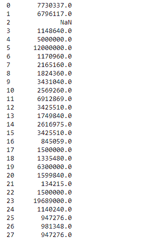
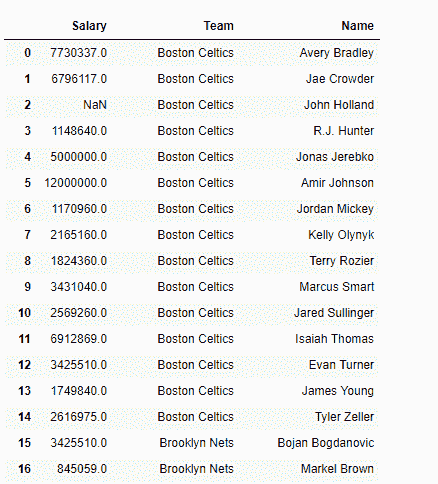

# Python | Pandas data frame . get()

> 原文:[https://www.geeksforgeeks.org/python-pandas-dataframe-get/](https://www.geeksforgeeks.org/python-pandas-dataframe-get/)

Python 是进行数据分析的优秀语言，主要是因为以数据为中心的 python 包的奇妙生态系统。 ***【熊猫】*** 就是其中一个包，让导入和分析数据变得容易多了。

熊猫 `**dataframe.get()**`功能用于从给定键的对象中获取项目。该键可以是一个或多个 dataframe 列。如果找不到，它将返回默认值。

> **语法:** DataFrame.get(键，默认值=无)
> 
> **参数:**
> **关键:**对象
> 
> **返回:**值:对象中包含的项目类型

有关代码中使用的 CSV 文件的链接，请单击此处的

**示例#1:** 使用`get()`函数从数据框中提取一列

```py
# importing pandas as pd
import pandas as pd

# Creating the dataframe 
df = pd.read_csv("nba.csv")

# Print the dataframe
df
```

**输出:**


现在应用`get()`功能。我们将从数据框中提取“工资”列。

```py
# applying get() function 
df.get("Salary")
```

**输出:**


请注意，输出不是数据帧，而是 pandas 系列对象。

**示例 2:** 使用`get()`函数以随机顺序一次提取多列

```py
# importing pandas as pd
import pandas as pd

# Creating the dataframe 
df = pd.read_csv("nba.csv")

df.get(["Salary", "Team", "Name"])
```

**输出:**

数据帧作为输出返回。列的顺序不是根据实际的数据帧，而是遵循我们在函数输入中提供给它的顺序。