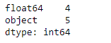
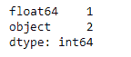
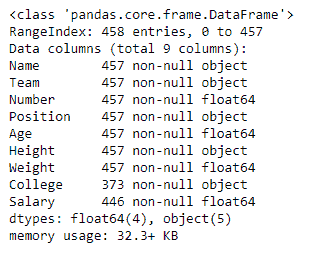

# Python | Pandas data frame . get _ dtype _ counts()

> 原文:[https://www . geesforgeks . org/python-pandas-data frame-get _ dtype _ counts/](https://www.geeksforgeeks.org/python-pandas-dataframe-get_dtype_counts/)

Python 是进行数据分析的优秀语言，主要是因为以数据为中心的 python 包的奇妙生态系统。 ***【熊猫】*** 就是其中一个包，让导入和分析数据变得容易多了。

熊猫 `**dataframe.get_dtype_counts()**`函数返回给定对象中数据类型的计数。它返回一个 pandas 系列对象，包含 pandas 对象中所有数据类型的计数。它与熊猫系列和数据框一起工作。

> **语法:** DataFrame.get_dtype_counts()
> 
> **返回:**值:系列:数据类型的计数

有关代码中使用的 CSV 文件的链接，请单击此处的

**示例#1:** 使用`get_dtype_counts()`函数查找熊猫数据帧对象的数据类型计数。

```py
# importing pandas as pd
import pandas as pd

# Creating the dataframe 
df = pd.read_csv("nba.csv")

# Print the dataframe
df
```


现在应用`get_dtype_counts()`功能。找出数据框中每种数据类型的出现频率。

```py
# applying get_dtype_counts() function 
df.get_dtype_counts()
```

**输出:**


注意，输出是一个 pandas 系列对象，包含数据帧中每个数据类型的计数。

**示例#2:** 仅在选定数量的数据框列上使用`get_dtype_counts()`功能。

```py
# importing pandas as pd
import pandas as pd

# Creating the dataframe 
df = pd.read_csv("nba.csv")

# Applying get_dtype_counts() function to 
# find the data type counts in modified dataframe.
df[["Salary", "Name", "Team"]].get_dtype_counts()
```



注意，输出是一个 pandas 系列对象，包含数据帧中每个数据类型的计数。我们可以使用`dataframe.info()`函数来验证所有这些结果。

```py
# Find out the types of all columns in the dataframe
df.info()
```

**输出:**
