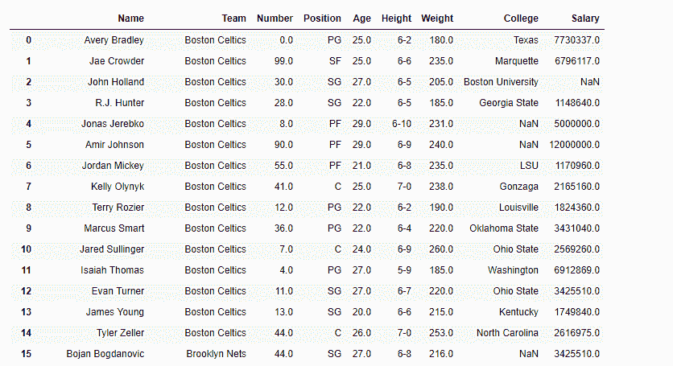

# Python | Pandas data frame . get _ value()

> 原文:[https://www . geesforgeks . org/python-pandas-data frame-get _ value/](https://www.geeksforgeeks.org/python-pandas-dataframe-get_value/)

Python 是进行数据分析的优秀语言，主要是因为以数据为中心的 python 包的奇妙生态系统。 ***【熊猫】*** 就是其中一个包，让导入和分析数据变得容易多了。

Pandas `**dataframe.get_value()**`功能用于快速检索数据框中通过的列和索引处的单个值。函数的输入是行标签和列标签。

> **语法:** DataFrame.get_value(索引，列，可获取=False)
> 
> **参数:**
> **索引:**行标签
> **列标签**列标签
> **可带:**将索引/列解释为索引器，默认为 False
> 
> **返回:**值:标量值

有关代码中使用的 CSV 文件的链接，请单击此处的

**示例#1:** 使用`get_value()`函数查找第 10 行的薪资值

```py
# importing pandas as pd
import pandas as pd

# Creating the dataframe 
df = pd.read_csv("nba.csv")

# Print the dataframe
df
```



```py
# applying get_value() function 
df.get_value(10, 'Salary')
```

**输出:**


**例 2:** 使用`get_value()`函数，传递列索引值而不是名称。

**注意:**我们也可以通过设置可取参数=True 来使用列的整数索引器值。

```py
# importing pandas as pd
import pandas as pd

# Creating the dataframe 
df = pd.read_csv("nba.csv")

# column index value of "Name" column is 0
# We have set takeable = True
# to interpret the index / col as indexer
df.get_value(4, 0, takeable = True)
```

**输出:**
