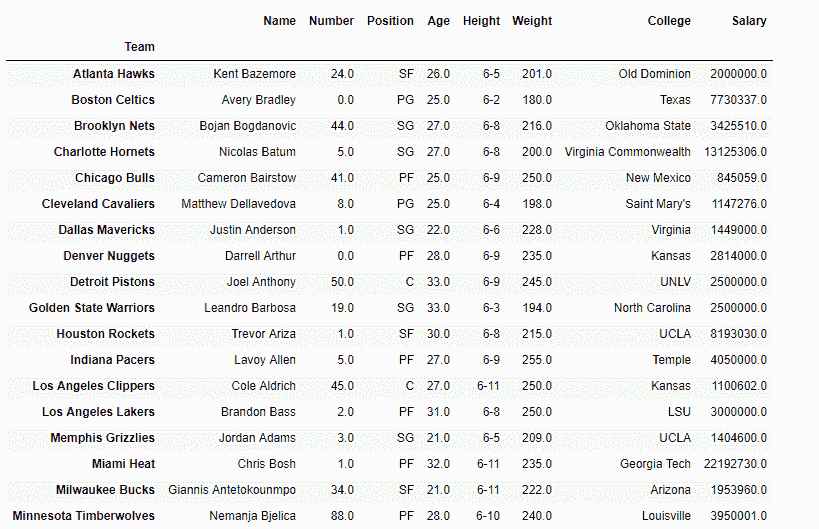
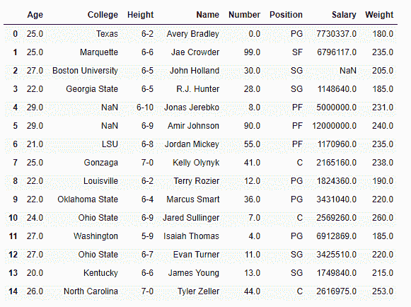
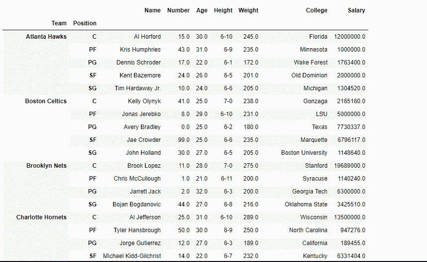

# python | pandas data frame . groupby()

> 哎哎哎:# t0]https://www . geeksforgeeks . org/python 熊猫 dataframe-groupby/

Python 是进行数据分析的优秀语言，主要是因为以数据为中心的 python 包的奇妙生态系统。 ***【熊猫】*** 就是其中一个包，让导入和分析数据变得容易多了。

**[熊猫分组](https://www.geeksforgeeks.org/pandas-groupby/)** 用于根据类别对数据进行分组，并对类别应用函数。它还有助于高效地聚合数据。

Pandas `**dataframe.groupby()**`功能用于根据一些标准将数据分组。熊猫的物体可以在它们的任何一个轴上分开。分组的抽象定义是提供标签到组名的映射。

> **语法:**data frame . group by(by =无，axis=0，level =无，as _ index =真，sort =真，group _ keys =真，挤压=假，**kwargs)
> 
> **参数:**
> **by :** 映射、函数、str 或可迭代
> **轴:** int，默认 0
> **级别:**如果轴是多索引(分层的)，则按特定的一个或多个级别
> **分组为 _index :** 对于聚合输出，返回以组标签作为索引的对象。仅与数据帧输入相关。as_index=False 实际上是“SQL 风格”的分组输出
> **排序:**排序组键。关闭此功能可以获得更好的性能。请注意，这不会影响各组内的观察顺序。groupby 保留每个组中的行顺序。
> **group_keys :** 调用 apply 时，将组合键添加到索引中以识别片段
> **挤压:**如果可能，降低返回类型的维度，否则返回一致的类型
> 
> **返回:**分组对象

有关代码中使用的 CSV 文件的链接，请单击此处的

**示例#1:** 使用`groupby()`功能根据“团队”对数据进行分组。

```py
# importing pandas as pd
import pandas as pd

# Creating the dataframe 
df = pd.read_csv("nba.csv")

# Print the dataframe
df
```


现在应用`groupby()`功能。

```py
# applying groupby() function to
# group the data on team value.
gk = df.groupby('Team')

# Let's print the first entries
# in all the groups formed.
gk.first()
```

**输出:**


让我们打印包含任意一个组的值。为此使用团队的名称。我们使用函数`get_group()`来查找任何组中包含的条目。

```py
# Finding the values contained in the "Boston Celtics" group
gk.get_group('Boston Celtics')
```

**输出:**


**示例 2:** 使用`groupby()`功能基于多个类别形成组(即使用多个列执行拆分)。

```py
# importing pandas as pd
import pandas as pd

# Creating the dataframe 
df = pd.read_csv("nba.csv")

# First grouping based on "Team"
# Within each team we are grouping based on "Position"
gkk = df.groupby(['Team', 'Position'])

# Print the first value in each group
gkk.first()
```

**输出:**


`groupby()`是一个非常强大的功能，有很多变化。这使得按照某些标准拆分数据帧的任务变得非常简单和高效。