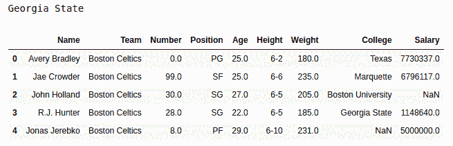

# python | pandas data frame . IAT[]

> 哎哎哎:# t0]https://www . geeksforgeeks . org/python 熊猫 data frame-IAT/

Python 是进行数据分析的优秀语言，主要是因为以数据为中心的 Python 包的奇妙生态系统。Pandas 就是其中之一，它让数据的导入和分析变得更加容易。

Pandas **iat[]** 方法用于在传递的位置返回数据帧中的数据。传递的位置的格式为[行中的位置，列中的位置]。这个方法的工作原理与熊猫 iloc[]类似，但 iat[]仅用于返回单个值，因此比它更快。

> **语法:** Dataframe.iat【行，列】
> **参数:**
> **位置:**列中元素的位置
> **标签:**行中元素的位置
> **返回类型:**单个元素在传递位置

要下载下例使用的数据集，点击这里的[。](https://media.geeksforgeeks.org/wp-content/uploads/nba.csv)

在下面的例子中，使用的数据框包含了一些 NBA 球员的数据。任何操作前的数据框图像附在下面。


**示例#1:**
在本例中，通过将 csv 的 URL 传递给 Pandas 来创建数据帧。read_csv()方法。之后，将 3 作为列位置传递，将 7 作为行位置传递，并使用返回该位置的值。iat[ ]方法。

## 蟒蛇 3

```
# importing pandas module 
import pandas as pd

# reading csv file from url 
data = pd.read_csv("https://media.geeksforgeeks.org/wp-content/uploads/nba.csv")

# creating column and row variables
column = 7
row = 3

# calling .iat[] method
output = data.iat[row, column]

# display
print(output)

# df display
data.head()
```

**输出:**
如输出图所示，可以对比输出，可以看到第 7 列第 3 个元素的 Value 被返回。



**注:**

*   不像，。iloc[ ]，此方法仅返回单个值。因此，dataframe.at[3:6，4:2]将返回一个错误
*   由于此方法仅适用于单个值，因此它比。iloc[]方法