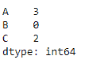
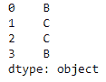

# python | pandas data frame . idxmax()

> 哎哎哎:# t0]https://www . geeksforgeeks . org/python 熊猫 data frame-idxmax/

Python 是进行数据分析的优秀语言，主要是因为以数据为中心的 python 包的奇妙生态系统。 ***【熊猫】*** 就是其中一个包，让导入和分析数据变得容易多了。

Pandas `**dataframe.idxmax()**`函数返回请求轴上最大值第一次出现的索引。当在任何索引中查找最大值的索引时，所有 NA/null 值都被排除在外。

> **语法:** DataFrame.idxmax(轴=0，skipna=True)
> 
> **参数:**
> **轴:**行为 0 或“索引”，列为 1 或“列”
> **skipna :** 排除 NA/null 值。如果整行/整列为“无”，结果将为“无”
> 
> **返回:** idxmax:系列

**例#1:** 使用`idxmax()`函数进行函数运算，沿指数轴找到最大值的指数。

```py
# importing pandas as pd
import pandas as pd

# Creating the dataframe 
df = pd.DataFrame({"A":[4, 5, 2, 6], 
                   "B":[11, 2, 5, 8],
                   "C":[1, 8, 66, 4]})

# Print the dataframe
df
```


现在沿着索引轴应用`idxmax()`功能。

```py
# applying idxmax() function.
df.idxmax(axis = 0)
```

**输出:**


如果我们查看 dataframe 中的值，我们可以验证函数返回的结果。该函数返回一个 pandas 系列对象，该对象包含每列中最大值的索引。

**例 2:** 使用`idxmax()`函数沿列轴查找最大值的索引。数据框包含`NA`值。

```py
# importing pandas as pd
import pandas as pd

# Creating the dataframe 
df = pd.DataFrame({"A":[4, 5, 2, None],
                   "B":[11, 2, None, 8], 
                   "C":[1, 8, 66, 4]})

# Skipna = True will skip all the Na values
# find maximum along column axis
df.idxmax(axis = 1, skipna = True)
```

**输出:**


输出是 pandas 系列，包含每一行的列标签，列标签具有最大值。