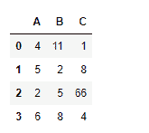
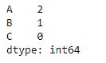
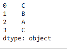

# python | pandas data frame . idxmin()

> 哎哎哎:# t0]https://www . geeksforgeeks . org/python 熊猫 data frame-idxmin/

Python 是进行数据分析的优秀语言，主要是因为以数据为中心的 python 包的奇妙生态系统。 ***【熊猫】*** 就是其中一个包，让导入和分析数据变得容易多了。

Pandas `**dataframe.idxmin()**`函数返回请求轴上最小值第一次出现的索引。当在任何索引中寻找最小值的索引时，所有的 NA/null 值都被排除。

> **语法:** DataFrame.idxmin(轴=0，skipna=True)
> 
> **参数:**
> **轴:**行为 0 或“索引”，列为 1 或“列”
> **skipna :** 排除 NA/null 值。如果整行/整列为“无”，结果将为“无”
> 
> **返回:** idxmin:系列

**例#1:** 使用`idxmin()`函数来求沿指数轴的最小值的指数。

```py
# importing pandas as pd
import pandas as pd

# Creating the dataframe 
df = pd.DataFrame({"A":[4, 5, 2, 6],
                   "B":[11, 2, 5, 8],
                   "C":[1, 8, 66, 4]})

# Print the dataframe
df
```



现在沿着索引轴应用`idxmin()`功能。

```py
# applying idxmin() function.
df.idxmin(axis = 0)
```

**输出:**


如果我们查看 dataframe 中的值，我们可以验证函数返回的结果。该函数返回一个 pandas 系列对象，该对象包含每列中最小值的索引。

**例 2:** 使用`idxmin()`函数沿列轴寻找最小值的索引。数据框包含`NA`值。

```py
# importing pandas as pd
import pandas as pd

# Creating the dataframe 
df = pd.DataFrame({"A":[4, 5, 2, None], 
                   "B":[11, 2, None, 8], 
                   "C":[1, 8, 66, 4]})

# Skipna = True will skip all the Na values
# find minimum along column axis
df.idxmin(axis = 1, skipna = True)
```

**输出:**
