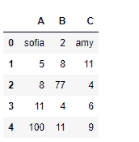
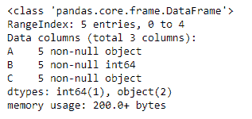
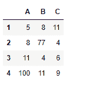
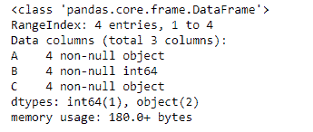
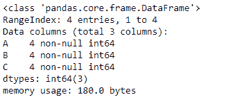
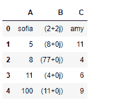
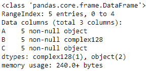
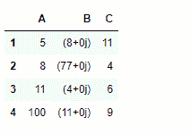
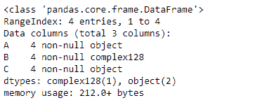
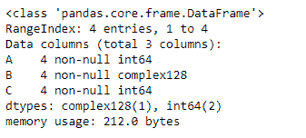

# Python | Pandas data frame . expert _ objects()

> 原文:[https://www . geesforgeks . org/python-pandas-data frame-expert _ objects/](https://www.geeksforgeeks.org/python-pandas-dataframe-infer_objects/)

Python 是进行数据分析的优秀语言，主要是因为以数据为中心的 python 包的奇妙生态系统。 ***【熊猫】*** 就是其中一个包，让导入和分析数据变得容易多了。

Pandas `**dataframe.infer_objects()**`函数试图为输入对象列推断更好的数据类型。此函数尝试对 object-dtyped 列进行软转换，保持非对象列和不可转换列不变。推理规则与正常的序列/数据帧构建期间相同。

> **语法:**data frame . expert _ objects()
> **返回:**已转换:与输入对象类型相同

**示例#1:** 使用`infer_objects()`函数推断更好的数据类型。

```
# importing pandas as pd
import pandas as pd

# Creating the dataframe 
df = pd.DataFrame({"A":["sofia", 5, 8, 11, 100],
                   "B":[2, 8, 77, 4, 11],
                   "C":["amy", 11, 4, 6, 9]})

# Print the dataframe
df
```

**输出:**


让我们看看 dataframe 中每一列的数据类型。

```
# to print the basic info
df.info()
```



正如我们在输出中看到的，第一列和第三列是`object`类型。而第二列为`int64`型。现在对数据帧进行切片，并从中创建一个新的数据帧。

```
# slice from the 1st row till end
df_new = df[1:]

# Let's print the new data frame
df_new

# Now let's print the data type of the columns
df_new.info()
```

**输出:**



正如我们在输出中看到的，列“A”和“C”是对象类型，即使它们包含整数值。那么，我们来试试`infer_objects()`功能。

```
# applying infer_objects() function.
df_new = df_new.infer_objects()

# Print the dtype after applying the function
df_new.info()
```

**输出:**

现在，如果我们看一下每一列的数据类型，可以看到“A”和“C”列现在都是`int64`类型。

**示例 2:** 使用`infer_objects()`函数为对象推断更好的数据类型。

```
# importing pandas as pd
import pandas as pd

# Creating the dataframe 
df = pd.DataFrame({"A":["sofia", 5, 8, 11, 100], 
                   "B":[2 + 2j, 8, 77, 4, 11],
                   "C":["amy", 11, 4, 6, 9]})

# Print the dataframe
df
```



让我们看看 dataframe 中每一列的数据类型。

```
# to print the basic info
df.info()
```



正如我们在输出中看到的，第一列和第三列是`object`类型。而第二列为`complex128`型。现在对数据帧进行切片，并从中创建一个新的数据帧。

```
# slice from the 1st row till end
df_new = df[1:]

# Let's print the new data frame
df_new

# Now let's print the data type of the columns
df_new.info()
```




正如我们在输出中看到的，列“A”和“C”是对象类型，即使它们包含整数值。类似的情况还有“B”栏。那么，我们来试试`infer_objects()`功能。

```
# applying infer_objects() function.
df_new = df_new.infer_objects()

# Print the dtype after applying the function
df_new.info()
```

**输出:**


请注意，“B”列的数据类型没有更改。`infer_objects()`函数尝试进行软转换，保持非对象和不可转换的列不变。