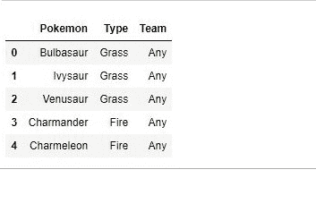
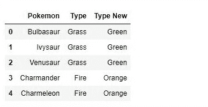

# Python | Pandas data frame . insert()

> 原文:[https://www . geesforgeks . org/python-pandas-data frame-insert/](https://www.geeksforgeeks.org/python-pandas-dataframe-insert/)

Pandas insert 方法允许用户在数据框或系列(一维数据框)中插入一列。也可以通过以下方法在数据框中手动插入一列，但这里没有太多自由。
例如，连列位置都无法确定，因此插入的列总是插入到最后一个位置。
**语法:**

```py
DataFrameName.insert(loc, column, value, allow_duplicates = False)
```

**参数:**

> **loc:** loc 是一个整数，它是我们要插入新列的列的位置。这会将该位置的现有列向右移动。
> **列:**列是一个字符串，是要插入的列的名称。
> **值:**值只是要插入的值。它可以是 int、string、float 或任何东西，甚至可以是值的序列/列表。仅提供一个值将为所有行设置相同的值。
> **allow _ duplicates:**allow _ duplicates 是一个布尔值，它检查同名列是否已经存在。

在这里找到[使用的 csv 文件的链接。](https://drive.google.com/open?id=1lTqPuIG8LArBAUCaLTvKi03-Vf2aA0Yq) 

#### 插入具有静态值的列:

## 蟒蛇 3

```py
# importing pandas module
import pandas as pd

# reading csv file
data = pd.read_csv("pokemon.csv")

# displaying  dataframe - Output 1
data.head()
```

**输出:**


**插列后:**

## 蟒蛇 3

```py
# importing pandas module
import pandas as pd

# reading csv file
data = pd.read_csv("pokemon.csv")

# displaying  dataframe - Output 1
data.head()

# inserting column with static value in data frame
data.insert(2, "Team", "Any")

# displaying data frame again - Output 2
data.head()
```



#### 为每行传递具有不同值的序列:

在本例中，创建了一个系列，一些值通过 for 循环传递给该系列。之后，在 pandas insert 函数中传递该序列，以便在数据框中用传递的值追加序列。

## 计算机编程语言

```py
# importing pandas module
import pandas as pd

# creating a blank series
Type_new = pd.Series([])

# reading csv file
data = pd.read_csv("pokemon.csv")

# running a for loop and assigning some values to series
for i in range(len(data)):
    if data["Type"][i] == "Grass":
        Type_new[i]="Green"

    elif data["Type"][i] == "Fire":
        Type_new[i]="Orange"

    elif data["Type"][i] == "Water":
        Type_new[i]="Blue"

    else:
        Type_new[i]= data["Type"][i]

# inserting new column with values of list made above       
data.insert(2, "Type New", Type_new)

# list output
data.head()
```

输出:

