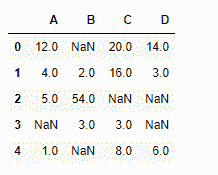
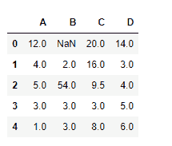
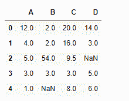

# Python | Pandas data frame . interpole()

> 原文:[https://www . geesforgeks . org/python-pandas-data frame-INTERPOL/](https://www.geeksforgeeks.org/python-pandas-dataframe-interpolate/)

Python 是进行数据分析的优秀语言，主要是因为以数据为中心的 python 包的奇妙生态系统。 ***【熊猫】*** 就是其中一个包，让导入和分析数据变得容易多了。

熊猫 `**dataframe.interpolate()**`功能基本上是用来填充数据框或系列中的`NA`值。但是，这是一个非常强大的功能来填充缺失的值。它使用各种插值技术来填充缺失的值，而不是对值进行硬编码。

> **语法:**data frame . interpole(方法='linear '，轴=0，限制=无，inplace=False，limit_direction='forward '，limit _ area =无，下转换=无，**kwargs)
> 
> **参数:**
> **方法:** { '线性'，'时间'，'指数'，'值'，'最近'，'零'，' slinear '，'二次'，'三次'，'重心'，' krogh '，'多项式'，'样条'，'分片 _ 多项式'，' from _ 导数'，' pchip '，' akima'}
> 
> **轴:** 0 逐列填，1 逐行填。
> **限制:**要填充的最大连续南次数。必须大于 0。
> **limit _ direction:**{ ' forward '，' backward '，' both'}，默认' forward '
> **limit _ area:**None(默认)无填充限制。`inside` 仅填充由有效值包围的 NaNs(插值)。`outside` 仅填充有效值以外的 NaNs(外推)。如果指定了限制，将在该方向上填充连续的 nan。
> **就位:**如有可能，将钕铁硼框架更新到位。
> **向下转换:**如果可能，向下转换数据类型。
> **kwargs :** 关键字参数传递给插值函数。
> 
> **返回:**在 NaNs 处插值的相同形状的系列或数据帧

**示例#1:** 使用`interpolate()`函数使用线性方法填充缺失值。

```
# importing pandas as pd
import pandas as pd

# Creating the dataframe 
df = pd.DataFrame({"A":[12, 4, 5, None, 1],
                   "B":[None, 2, 54, 3, None],
                   "C":[20, 16, None, 3, 8],
                   "D":[14, 3, None, None, 6]})

# Print the dataframe
df
```



让我们使用线性方法对缺失值进行插值。请注意，线性方法忽略索引，并将值视为等距。

```
# to interpolate the missing values
df.interpolate(method ='linear', limit_direction ='forward')
```

**输出:**


从输出可以看出，第一行的值无法填充，因为值的填充方向是`forward`，并且没有可以用于插值的前一个值。

**示例#2:** 使用`interpolate()`函数，使用线性方法在向后方向内插缺失值，并限制可填充的连续`Na`值的最大数量。

```
# importing pandas as pd
import pandas as pd

# Creating the dataframe 
df = pd.DataFrame({"A":[12, 4, 5, None, 1],
                   "B":[None, 2, 54, 3, None],
                   "C":[20, 16, None, 3, 8],
                   "D":[14, 3, None, None, 6]})

# to interpolate the missing values
df.interpolate(method ='linear', limit_direction ='backward', limit = 1)
```

**输出:**

注意第四列，只有一个缺失值被填充，因为我们已经将限制设置为 1。无法填充最后一行中缺少的值，因为在该行之后不存在可以插值该值的行。