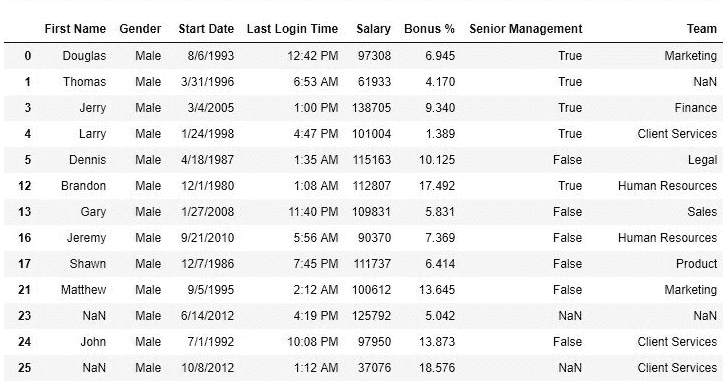
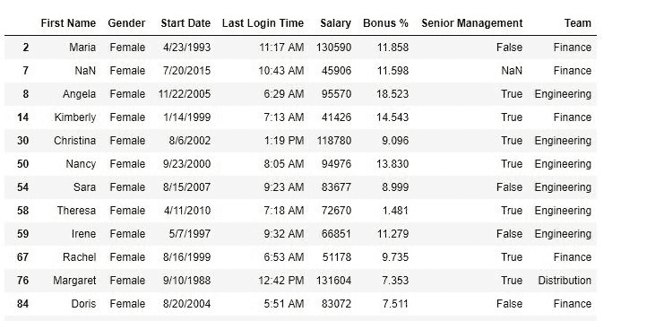

# python | pandas data frame . isin()

> 哎哎哎:# t0]https://www . geeksforgeeks . org/python 熊猫 dataframe-isin/

Python 是进行数据分析的优秀语言，主要是因为以数据为中心的 python 包的奇妙生态系统。 ***【熊猫】*** 就是其中一个包，让导入和分析数据变得容易多了。

熊猫 **`isin()`** 方法用于过滤数据帧。`isin()` 方法有助于选择在特定列中具有特定(或多个)值的行。

> **语法:** DataFrame.isin(值)
> 
> **参数:**
> **值:**可迭代、序列、列表、元组、数据帧或字典，用于检查调用方序列/数据帧。
> 
> **返回类型:**维度布尔型的数据框。

要下载使用的 CSV 文件，点击这里[。](https://media.geeksforgeeks.org/wp-content/uploads/employees.csv)

**示例#1:单参数过滤**
在以下示例中，将检查行并返回一个布尔序列，该序列在性别=“男性”处为真。然后，序列被传递到数据帧，以查看新的过滤数据帧。

```py
# importing pandas package
import pandas as pd

# making data frame from csv file
data = pd.read_csv("employees.csv")

# creating a bool series from isin()
new = data["Gender"].isin(["Male"])

# displaying data with gender = male only
data[new]
```

**输出:**
如输出图像所示，只返回性别为“男”的行。


**示例#2:多参数过滤**
在以下示例中，数据框是根据性别和团队进行过滤的。返回性别为“女性”和团队为“工程”、“分销”或“财务”的行。

```py
# importing pandas package
import pandas as pd

# making data frame from csv file
data = pd.read_csv("employees.csv")

# creating filters of bool series from isin()
filter1 = data["Gender"].isin(["Female"])
filter2 = data["Team"].isin(["Engineering", "Distribution", "Finance" ])

# displaying data with both filter applied and mandatory 
data[filter1 & filter2]
```

**输出:**
如输出图像所示，返回性别=“女”和团队=“工程”、“配送”或“财务”的行。

