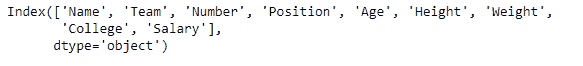

# python | pandas data frame . keys()

> 原文:[https://www.geeksforgeeks.org/python-pandas-dataframe-keys/](https://www.geeksforgeeks.org/python-pandas-dataframe-keys/)

Python 是进行数据分析的优秀语言，主要是因为以数据为中心的 python 包的奇妙生态系统。 ***【熊猫】*** 就是其中一个包，让导入和分析数据变得容易多了。

熊猫 `**dataframe.keys()**`函数返回熊猫对象的“信息轴”。如果熊猫对象是**系列**，那么它返回索引。如果熊猫对象是**数据帧**，那么它返回列。如果熊猫对象是**面板**，则返回主轴。

> **语法:**数据框键()

要链接到 CSV 文件，请单击此处的

**示例#1:** 使用`keys()`函数查找数据框的列。

```py
# importing pandas as pd
import pandas as pd

# Creating the dataframe 
df = pd.read_csv("nba.csv")

# Print the dataframe
df
```


```py
# find the keys of the dataframe
df.keys()
```

**输出:**


**例 2:** 使用`keys()`功能找到熊猫的索引**系列**对象。

```py
# importing pandas as pd
import pandas as pd

# Creating the series 
sr = pd.Series([12, 5, None, 5, None, 11])

# Print the series
sr
```


```py
# to find the index
sr.keys()
```

**输出:**
