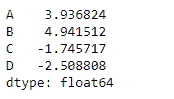
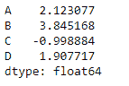

# python | pandas data frame . Kurt()

> 哎哎哎:# t0]https://www . geeksforgeeks . org/python 熊猫 dataframe-kurt/

Python 是进行数据分析的优秀语言，主要是因为以数据为中心的 python 包的奇妙生态系统。 ***【熊猫】*** 就是其中一个包，让导入和分析数据变得容易多了。

Pandas `**dataframe.kurt()**`函数使用费希尔峰度定义(正态峰度== 0.0)返回请求轴上的无偏峰度。用 N-1 归一化。

> **语法:**data frame . Kurt(axis =无，skipna =无，level =无，numeric _ only =无，**kwargs)
> 
> **参数:**
> **轴:** {index (0)，columns (1)}
> **skipna :** 计算结果时排除 NA/null 值
> **级别:**如果轴是 MultiIndex(分层)，沿特定级别计数，折叠成 Series
> **numeric _ only:**仅包括 float、int、boolean 列。如果没有，将尝试使用所有内容，然后只使用数字数据。不适用于系列。
> 
> **返回:**库尔特:序列或数据帧(如果指定了级别)

**示例#1:** 使用`kurt()`函数查找索引轴上的峰度。

```
# importing pandas as pd
import pandas as pd

# Creating the dataframe 
df = pd.DataFrame({"A":[12, 4, 5, 44, 1],
                   "B":[5, 2, 54, 3, 2],
                   "C":[20, 16, 7, 3, 8],
                   "D":[14, 3, 17, 2, 6]})

# Print the dataframe
df
```


我们用`dataframe.kurt()`函数求峰度。

```
# find the kurtosis over the index axis
df.kurt(axis = 0)
```

**输出:**


**示例#2:** 使用`kurt()`函数查找数据帧的峰度，该数据帧中有一些`Na`值。求指数轴上的峰度。

```
# importing pandas as pd
import pandas as pd

# Creating the dataframe 
df = pd.DataFrame({"A":[12, 4, 5, None, 1], 
                   "B":[7, 2, 54, 3, None],
                   "C":[20, 16, 11, 3, 8], 
                   "D":[14, 3, None, 2, 6]})

# to find the kurtosis
# skip the Na values when finding the kurtosis
df.kurt(axis = 0, skipna = True)
```

**输出:**
