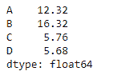
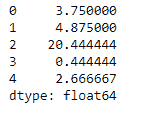

# python | pandas data frame . mad()

> 原文:[https://www.geeksforgeeks.org/python-pandas-dataframe-mad/](https://www.geeksforgeeks.org/python-pandas-dataframe-mad/)

Python 是进行数据分析的优秀语言，主要是因为以数据为中心的 python 包的奇妙生态系统。 ***【熊猫】*** 就是其中一个包，让导入和分析数据变得容易多了。

熊猫 `**dataframe.mad()**`函数返回所请求轴值的平均绝对偏差。数据集的平均绝对偏差是每个数据点和平均值之间的平均距离。它让我们了解了数据集的可变性。

> **语法:** DataFrame.mad(轴=无，skipna =无，级别=无)
> 
> **参数:**
> **轴:** {index (0)，columns (1)}
> **skipna :** 计算结果时排除 NA/null 值
> **级别:**如果轴是 MultiIndex(分层)，沿特定级别计数，折叠成 Series
> **numeric _ only:**仅包括 float、int、boolean 列。如果没有，将尝试使用所有内容，然后只使用数字数据。不适用于系列。
> 
> **返回:** mad:序列或数据帧(如果指定了级别)

**示例#1:** 使用`mad()`函数找到指数轴上值的平均绝对偏差。

```py
# importing pandas as pd
import pandas as pd

# Creating the dataframe 
df = pd.DataFrame({"A":[12, 4, 5, 44, 1],
                   "B":[5, 2, 54, 3, 2], 
                   "C":[20, 16, 7, 3, 8],
                   "D":[14, 3, 17, 2, 6]})

# Print the dataframe
df
```


我们用`dataframe.mad()`函数求平均绝对偏差。

```py
# find the mean absolute deviation 
# over the index axis
df.mad(axis = 0)
```

**输出:**


**示例#2:** 使用`mad()`函数查找列轴上值的平均绝对偏差，该列轴中有一些`Na`值。

```py
# importing pandas as pd
import pandas as pd

# Creating the dataframe 
df = pd.DataFrame({"A":[12, 4, 5, None, 1],
                   "B":[7, 2, 54, 3, None],
                   "C":[20, 16, 11, 3, 8], 
                   "D":[14, 3, None, 2, 6]})

# To find the mean absolute deviation
# skip the Na values when finding the mad value
df.mad(axis = 1, skipna = True)
```

**输出:**
