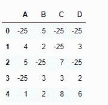
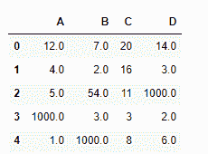

# python | pandas data frame . mask()

> 原文:[https://www.geeksforgeeks.org/python-pandas-dataframe-mask/](https://www.geeksforgeeks.org/python-pandas-dataframe-mask/)

Python 是进行数据分析的优秀语言，主要是因为以数据为中心的 python 包的奇妙生态系统。 ***【熊猫】*** 就是其中一个包，让导入和分析数据变得容易多了。

熊猫 `**dataframe.mask()**`函数返回一个与自身形状相同的对象，其对应的条目来自自身，条件为假，否则来自其他对象。另一个对象可以是标量、序列、数据帧或者是可调用的。mask 方法是 if-then 习语的一种应用。对于调用 DataFrame 中的每个元素，如果 cond 为 False，则使用该元素；否则，使用 DataFrame other 中的相应元素。

> **语法:** DataFrame.mask(cond，other=nan，inplace=False，axis=None，level=None，errors='raise '，try_cast=False，raise_on_error=None)
> 
> **参数:**
> **cond :** 其中 cond 为 False，保持原值。如果为真，则替换为来自其他的相应值。如果 cond 是可调用的，则它是在 NDFrame 上计算的，并且应该返回布尔型 NDFrame 或数组。可调用的不能改变输入 NDFrame(尽管熊猫没有检查它)。
> 
> **其他:【cond 为真的条目将替换为其他条目的相应值。如果 other 是可调用的，则它是在 NDFrame 上计算的，并且应该返回标量或 NDFrame。可调用的不能改变输入 NDFrame(尽管熊猫没有检查它)。
> **在位:**是否对数据执行到位操作
> **轴:**对齐轴如有需要，默认无
> **级别:**对齐级别如有需要，默认无
> **错误:** str，{ '提升'，'忽略' }，默认'提升'
> 提升允许提升异常并忽略抑制异常。出错时返回原始对象。请注意，目前这个参数不会影响结果，并且总是强制转换为合适的数据类型。**
> 
> **try_cast :** 尝试将结果强制转换回输入类型(如果可能)，
> 
> **返回:** wh:与来电者类型相同

**示例#1:** 使用`mask()`函数将数据框中大于 10 的所有值替换为-25

```py
# importing pandas as pd
import pandas as pd

# Creating the dataframe 
df = pd.DataFrame({"A":[12, 4, 5, 44, 1],
                   "B":[5, 2, 54, 3, 2],
                   "C":[20, 16, 7, 3, 8],
                   "D":[14, 3, 17, 2, 6]})

# Print the dataframe
df
```


让我们使用`dataframe.mask()`函数将所有大于 10 的值替换为-25

```py
# replace values greater than 10 with -25
df.mask(df > 10, -25)
```

**输出:**


**示例 2:** 使用带有可调用的`mask()`函数。将所有`Na`值替换为 1000。

```py
# importing pandas as pd
import pandas as pd

# Creating the dataframe 
df = pd.DataFrame({"A":[12, 4, 5, None, 1],
                   "B":[7, 2, 54, 3, None],
                   "C":[20, 16, 11, 3, 8],
                   "D":[14, 3, None, 2, 6]})

# replace the Na values with 1000
df.mask(df.isna(), 1000))
```

**输出:**
