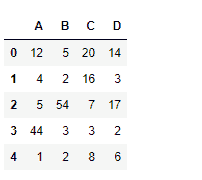
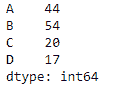
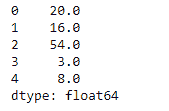

# python | pandas data frame . max()

> 哎哎哎:# t0]https://www . geeksforgeeks . org/python 熊猫 dataframe-max/

Python 是进行数据分析的优秀语言，主要是因为以数据为中心的 python 包的奇妙生态系统。 ***【熊猫】*** 就是其中一个包，让导入和分析数据变得容易多了。

熊猫 `**dataframe.max()**`函数返回给定对象中的最大值。如果输入是一个序列，该方法将返回一个标量，该标量将是该序列中值的最大值。如果输入是数据帧，则该方法将返回数据帧中指定轴上最大值的系列。默认情况下，轴是索引轴。

> **语法:** DataFrame.max(轴=无，skipna =无，级别=无，numeric _ only =无，**kwargs)
> 
> **参数:**
> **轴:** {index (0)，columns (1)}
> **skipna :** 计算结果时排除 NA/null 值
> **级别:**如果轴是 MultiIndex(分层)，沿特定级别计数，折叠成 Series
> **numeric _ only:**仅包括 float、int、boolean 列。如果没有，将尝试使用所有内容，然后只使用数字数据。不适用于系列。
> 
> **返回:**最大值:系列或数据帧(如果指定了级别)

**示例#1:** 使用`max()`函数查找索引轴上的最大值。

```
# importing pandas as pd
import pandas as pd

# Creating the dataframe 
df = pd.DataFrame({"A":[12, 4, 5, 44, 1],
                   "B":[5, 2, 54, 3, 2],
                   "C":[20, 16, 7, 3, 8], 
                   "D":[14, 3, 17, 2, 6]})

# Print the dataframe
df
```



让我们使用`dataframe.max()`函数找到索引轴上的最大值

```
# Even if we do not specify axis = 0, 
# the method will return the max over
# the index axis by default
df.max(axis = 0)
```

**输出:**


**示例 2:** 对具有`Na`值的数据框使用`max()`功能。还要找到柱轴上的最大值。

```
# importing pandas as pd
import pandas as pd

# Creating the dataframe 
df = pd.DataFrame({"A":[12, 4, 5, None, 1], 
                   "B":[7, 2, 54, 3, None],
                   "C":[20, 16, 11, 3, 8],
                   "D":[14, 3, None, 2, 6]})

# skip the Na values while finding the maximum
df.max(axis = 1, skipna = True)
```

**输出:**
