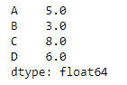
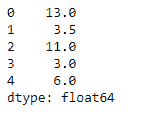

# Python | Pandas data frame . median()

> 原文:[https://www . geesforgeks . org/python-pandas-data frame-median/](https://www.geeksforgeeks.org/python-pandas-dataframe-median/)

Python 是进行数据分析的优秀语言，主要是因为以数据为中心的 python 包的奇妙生态系统。 ***【熊猫】*** 就是其中一个包，让导入和分析数据变得容易多了。

Pandas `**dataframe.median()**`函数返回所请求轴
值的中值。如果该方法应用于 Pandas 系列对象，则该方法返回一个标量值，该值是数据帧中所有观察值的中值。如果该方法应用于 pandas dataframe 对象，则该方法返回一个 pandas series 对象，该对象包含指定轴上的值的中值。

> **语法:**数据框.中值(轴=无，skipna =无，级别=无，numeric _ only =无，**kwargs)
> **参数:**
> **轴:**沿给定轴将对象与阈值对齐。
> **skipna :** 计算结果时排除 NA/null 值
> **级别:**如果轴是 MultiIndex(分层)，沿特定级别计数，折叠成 Series
> **numeric _ only:**仅包括 float、int、boolean 列。如果没有，将尝试使用所有内容，然后只使用数字数据。不适用于系列。
> 
> **返回:**中间值:序列或数据帧(如果指定了级别)

**示例#1:** 使用`median()`函数找到索引轴上所有观察值的中值。

```py
# importing pandas as pd
import pandas as pd

# Creating the dataframe 
df = pd.DataFrame({"A":[12, 4, 5, 44, 1],
                   "B":[5, 2, 54, 3, 2],
                   "C":[20, 16, 7, 3, 8], 
                   "D":[14, 3, 17, 2, 6]})

# Print the dataframe
df
```


让我们使用`dataframe.median()`函数找到索引轴上的中间值

```py
# Find median Even if we do not specify axis = 0, the method 
# will return the median over the index axis by default
df.median(axis = 0)
```

**输出:**



**示例 2:** 在具有`Na`值的数据帧上使用`median()`函数。还要找到柱轴上的中间值。

```py
# importing pandas as pd
import pandas as pd

# Creating the dataframe 
df = pd.DataFrame({"A":[12, 4, 5, None, 1],
                   "B":[7, 2, 54, 3, None], 
                   "C":[20, 16, 11, 3, 8], 
                   "D":[14, 3, None, 2, 6]})

# Print the dataframe
df
```


让我们实现中值函数。

```py
# skip the Na values while finding the median
df.median(axis = 1, skipna = True)
```

**输出:**
