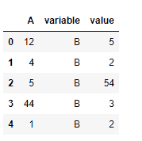
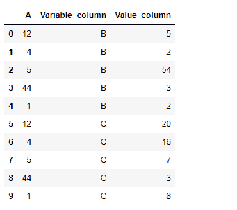

# Python | Pandas data frame . melt()

> 原文:[https://www.geeksforgeeks.org/python-pandas-dataframe-melt/](https://www.geeksforgeeks.org/python-pandas-dataframe-melt/)

Python 是进行数据分析的优秀语言，主要是因为以数据为中心的 python 包的奇妙生态系统。 ***【熊猫】*** 就是其中一个包，让导入和分析数据变得容易多了。

Pandas `**dataframe.melt()**`函数将数据帧从宽格式取消固定为长格式，可选地保留标识符变量设置。该函数有助于将数据框消息转换为一种格式，其中一列或多列是标识符变量(id_vars)，而所有其他被认为是测量变量(value_vars)的列被“取消固定”到行轴，只留下两个非标识符列，“变量”和“值”。

> **语法:**data frame . melt(id _ vars =无，value _ vars =无，var _ name =无，value_name='value '，col _ level =无)
> **参数:**
> **框架:**data frame
> **id _ vars:**要用作标识符变量的列
> **value_vars :** 要取消固定的列。如果未指定，将使用所有未设置为 id_vars 的列。
> **var_name :** 用于“变量”列的名称。如果没有，则使用 frame.columns.name 或“variable”。
> **value_name :** 用于“value”列的名称
> **col_level :** 如果列是多索引，则使用该级别进行熔化。
> 
> **将:**数据帧返回为一个或多个列为标识符变量的格式

**示例#1:** 使用`melt()`函数将列“A”设置为标识符变量，将列“B”设置为值变量。

## 蟒蛇 3

```
# importing pandas as pd
import pandas as pd

# Creating the dataframe 
df = pd.DataFrame({"A":[12, 4, 5, 44, 1], 
                   "B":[5, 2, 54, 3, 2], 
                   "C":[20, 16, 7, 3, 8], 
                   "D":[14, 3, 17, 2, 6]})

# Print the dataframe
df
```


让我们使用`dataframe.melt()`函数将列“A”设置为标识符变量，将列“B”设置为值变量。

## 蟒蛇 3

```
# function to unpivot the dataframe
df.melt(id_vars =['A'], value_vars =['B'])
```

**输出:**


**例 2:** 使用`melt()`函数将列“A”设置为标识符变量，将列“B”和“C”设置为值变量。还可以自定义值列和变量列的名称。

## 蟒蛇 3

```
# importing pandas as pd
import pandas as pd

# Creating the dataframe 
df = pd.DataFrame({"A":[12, 4, 5, 44, 1],
                   "B":[5, 2, 54, 3, 2], 
                   "C":[20, 16, 7, 3, 8], 
                   "D":[14, 3, 17, 2, 6]})

# Print the dataframe
df
```


让我们使用`dataframe.melt()`函数将列“A”设置为标识符变量，将列“B”和“C”设置为值变量。

## 蟒蛇 3

```
# function to unpivot the dataframe
# We will also provide a customized name to the value and variable column

df.melt(id_vars =['A'], value_vars =['B', 'C'], 
        var_name ='Variable_column', value_name ='Value_column')
```

**输出:**

