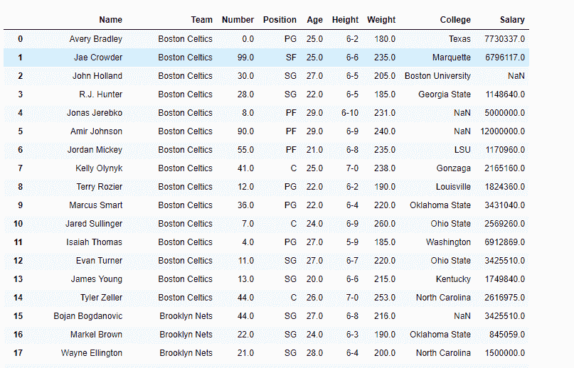
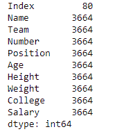
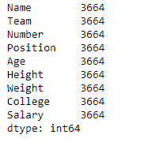

# Python | Pandas data frame . memory _ usage()

> 原文:[https://www . geesforgeks . org/python-pandas-data frame-memory _ usage/](https://www.geeksforgeeks.org/python-pandas-dataframe-memory_usage/)

Python 是进行数据分析的优秀语言，主要是因为以数据为中心的 python 包的奇妙生态系统。 ***【熊猫】*** 就是其中一个包，让导入和分析数据变得容易多了。
Pandas**data frame . memory _ usage()**函数返回每列的内存使用情况，单位为字节。内存使用可以选择性地包括索引和对象数据类型元素的贡献。默认情况下，该值显示在 DataFrame.info 中。

> **语法:**DataFrame . memory _ usage(index = True，deep=False)
> **参数:**
> **index :** 指定是否在返回的 Series 中包含 data frame 的索引的内存使用情况。如果 index=True，则输出中第一项的索引的内存使用情况。
> **deep :** 如果为 True，则通过查询对象数据类型来深入检查数据，以获取系统级内存消耗，并将其包含在返回值中。
> **返回:**一个系列，其索引是原始列名，其值是每列的内存使用量(以字节为单位)

有关代码中使用的 CSV 文件的链接，请单击此处的
**示例#1:** 使用 memory_usage()函数打印数据框中每一列的内存使用情况以及索引的内存使用情况。

## 蟒蛇 3

```
# importing pandas as pd
import pandas as pd

# Creating the dataframe
df = pd.read_csv("nba.csv")

# Print the dataframe
df
```



我们使用 memory_usage()函数来查找每一列的内存使用情况。

## 蟒蛇 3

```
# Function to find memory use of each
# column along with the index
# even if we do not set index = True,
# it will show the index usage as well by default.
df.memory_usage(index = True)
```

**输出:**



**示例#2:** 使用 memory_usage()函数查找每列的内存使用情况，但不查找索引的内存使用情况。

## 蟒蛇 3

```
# importing pandas as pd
import pandas as pd

# Creating the dataframe
df = pd.read_csv("nba.csv")

# Function to find memory use of each
# column but not of the index
# we set index = False
df.memory_usage(index = False)
```

**输出:**

