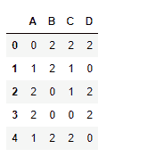

# python | pandas data frame . mod()

> 哎哎哎:# t0]https://www . geeksforgeeks . org/python 熊猫 dataframe-mod/

Python 是进行数据分析的优秀语言，主要是因为以数据为中心的 python 包的奇妙生态系统。 ***【熊猫】*** 就是其中一个包，让导入和分析数据变得容易多了。
熊猫 **dataframe.mod()** 函数返回 dataframe 和其他元素的模(二进制运算符 mod)。该函数本质上与 Dataframe % other 相同，但支持用 fill_value 替换其中一个输入中缺失的数据。该函数可用于序列或数据帧。

> **语法:** DataFrame.mod(other，axis='columns '，level=None，fill_value=None)
> **参数:**
> **Other :** Series，DataFrame，或常量
> **axis :** 对于 Series 输入，axis 要匹配
> **级别上的 Series 索引:**跨级别广播，匹配传递的 MultiIndex 级别上的索引值
> **fill_value :** 填充现有缺失如果两个相应数据框位置的数据都丢失，结果将丢失
> **返回:**结果:数据框

**示例#1:** 使用 mod()函数找到数据帧中每个具有常数的值的模。

## 蟒蛇 3

```
# importing pandas as pd
import pandas as pd

# Creating the dataframe
df = pd.DataFrame({"A":[12, 4, 5, 44, 1],
                   "B":[5, 2, 54, 3, 2],
                   "C":[20, 16, 7, 3, 8],
                   "D":[14, 3, 17, 2, 6]})

# Print the dataframe
df
```


让我们使用 dataframe.mod()函数找到数据帧的模 3

## 蟒蛇 3

```
# find mod of dataframe values with 3
df.mod(3)
```

**输出:**



**示例#2:** 使用 mod()函数在列轴上找到一系列的模。

## 蟒蛇 3

```
# importing pandas as pd
import pandas as pd

# Creating the dataframe
df = pd.DataFrame({"A":[12, 4, 5, 44, 1],
                   "B":[5, 2, 54, 3, 2],
                   "C":[20, 16, 7, 3, 8],
                   "D":[14, 3, 17, 2, 6]})

# Print the dataframe
df
```