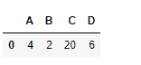
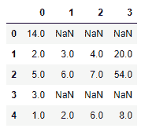

# python | pandas data frame . mode()

> 原文:[https://www.geeksforgeeks.org/python-pandas-dataframe-mode/](https://www.geeksforgeeks.org/python-pandas-dataframe-mode/)

Python 是进行数据分析的优秀语言，主要是因为以数据为中心的 python 包的奇妙生态系统。 ***【熊猫】*** 就是其中一个包，让导入和分析数据变得容易多了。

熊猫 `**dataframe.mode()**`功能获取所选轴上每个元素的模式。为每个标签的每个模式添加一行，用 nan 填充空白。请注意，可能会为选定的轴返回多个值(当多个项目共享最大频率时)，这就是返回数据框的原因。

> **语法:** DataFrame.mode(轴=0，numeric_only=False)
> **参数:**
> **轴:**获取各列的模式 1、获取各行的模式
> **numeric_only :** 如果为 True，则仅适用于数值列
> 
> **返回:**模式:数据帧(已排序)

**示例#1:** 使用`mode()`功能找到索引轴上的模式。

```py
# importing pandas as pd
import pandas as pd

# Creating the dataframe 
df=pd.DataFrame({"A":[14,4,5,4,1],
                 "B":[5,2,54,3,2],
                 "C":[20,20,7,3,8],
                 "D":[14,3,6,2,6]})

# Print the dataframe
df
```


让我们使用`dataframe.mode()`功能找到数据帧的模式

```py
# find mode of dataframe 
df.mode()
```

**输出:**


**示例 2:** 使用`mode()`功能在列轴上查找模式

```py
# importing pandas as pd
import pandas as pd

# Creating the dataframe 
df=pd.DataFrame({"A":[14,4,5,4,1],
                 "B":[5,2,54,3,2],
                 "C":[20,20,7,3,8],
                 "D":[14,3,6,2,6]})

# Print the dataframe
df
```


让我们使用`dataframe.mode()`功能找到模式

```py
# axis = 1 indicates over the column axis
df.mode(axis = 1)
```

**输出:**


在第 0 行和第 3 行，14 和 3 是模式，因为它们出现的次数最多(即 2 次)。在列的其余部分，所有元素都是模式，因为它们具有相同的出现频率。