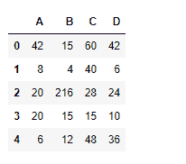
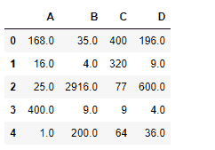

# python | pandas data frame . mul()

> 哎哎哎:# t0]https://www . geeksforgeeks . org/python 熊猫 data frame-mul/

Python 是进行数据分析的优秀语言，主要是因为以数据为中心的 python 包的奇妙生态系统。 ***【熊猫】*** 就是其中一个包，让导入和分析数据变得容易多了。
熊猫 **dataframe.mul()** 函数返回 dataframe 和其他元素的乘法。这个函数本质上做了与 dataframe * other 相同的事情，但是它提供了额外的支持来处理其中一个输入中的缺失值。

> **语法:** DataFrame.mul(other，axis='columns '，level=None，fill_value=None)
> **参数:**
> **other :** Series，DataFrame，或常量
> **axis :** 对于 Series 输入，axis 要匹配
> **级别上的 Series 索引:**跨级别广播，匹配传递的 MultiIndex 级别上的索引值
> **fill_value :** 填充现有如果两个相应数据框位置的数据都丢失，结果将丢失
> **返回:**结果:数据框

**示例#1:** 使用 mul()函数查找数据帧与序列的乘积。
**注:**与级数相乘时，用于相乘的数据框轴必须与级数索引相匹配。

## 蟒蛇 3

```py
# importing pandas as pd
import pandas as pd

# Creating the first dataframe
df1=pd.DataFrame({"A":[14,4,5,4,1],
                  "B":[5,2,54,3,2],
                  "C":[20,20,7,3,8],
                  "D":[14,3,6,2,6]})

# Print the dataframe
df1
```


让我们创建系列

## 蟒蛇 3

```py
# importing pandas as pd
import pandas as pd

# create series
sr = pd.Series([3, 2, 4, 5, 6])

# Print series
sr
```


让我们使用 dataframe.mul()函数来执行乘法

## 蟒蛇 3

```py
# find multiplication over the index axis
df1.mul(sr, axis = 0)
```

**输出:**



**例 2:** 用 mul()函数求两个数据帧的乘积。一个数据帧包含数值。

## 蟒蛇 3

```py
# importing pandas as pd
import pandas as pd

# Creating the first dataframe
df1=pd.DataFrame({"A":[14,4,5,4,1],
                  "B":[5,2,54,3,2],
                  "C":[20,20,7,3,8],
                  "D":[14,3,6,2,6]})

# Creating the second dataframe with <code>Na</code> value
df2=pd.DataFrame({"A":[12,4,5,None,1],
                  "B":[7,2,54,3,None],
                  "C":[20,16,11,3,8],
                  "D":[14,3,None,2,6]})

# Print the second dataframe
df2
```


让我们使用 dataframe.mul()函数来查找两个 dataframe 的乘积，并处理缺失的值。

## 蟒蛇 3

```py
# fill the missing values with 100
df1.mul(df2, fill_value = 100)
```

**输出:**



注意，乘法前
所有缺失的值单元格都已经填充了 100