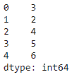
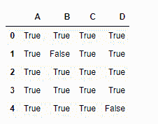
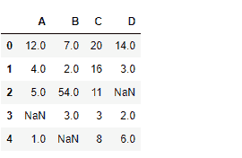
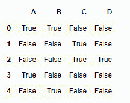

# python | pandas data frame . ne()

> 哎哎哎:# t0]https://www . geeksforgeeks . org/python 熊猫 dataframe-ne/

Python 是进行数据分析的优秀语言，主要是因为以数据为中心的 python 包的奇妙生态系统。 ***【熊猫】*** 就是其中一个包，让导入和分析数据变得容易多了。
Pandas **dataframe.ne()** 函数检查数据帧元素与常量、序列或其他数据帧元素之间的不相等性。如果比较中的两个值不相等，则返回 true，否则返回 false。

> **语法:** DataFrame.ne(other，axis='columns '，level=None)
> **参数:**
> **other :** Series，DataFrame，或常量
> **axis :** 对于 Series 输入，axis 要匹配
> **级别上的 Series 索引:**跨级别广播，匹配传递的 MultiIndex 级别上的索引值
> **返回:**结果:DataFrame

**示例#1:** 使用 ne()函数检查数列和数据框之间的不等式。

## 蟒蛇 3

```py
# importing pandas as pd
import pandas as pd

# Creating the first dataframe
df1=pd.DataFrame({"A":[14,4,5,4,1],
                  "B":[5,2,54,3,2],
                  "C":[20,20,7,3,8],
                  "D":[14,3,6,2,6]})

# Print the dataframe
df1
```


让我们创建系列

## 蟒蛇 3

```py
# importing pandas as pd
import pandas as pd

# create series
sr = pd.Series([3, 2, 4, 5, 6])

# Print series
sr
```



让我们使用 dataframe.ne()函数来计算不等式

## 蟒蛇 3

```py
# evaluate inequality over the index axis
df.ne(sr, axis = 0)
```

**输出:**



所有真值单元格表示比较值彼此不相等，而所有假值单元格表示比较值彼此相等。

**示例 2:** 使用 ne()函数检查两个数据帧的不相等性。一个数据帧包含数值。

## 蟒蛇 3

```py
# importing pandas as pd
import pandas as pd

# Creating the first dataframe
df1=pd.DataFrame({"A":[14,4,5,4,1],
                  "B":[5,2,54,3,2],
                  "C":[20,20,7,3,8],
                  "D":[14,3,6,2,6]})

# Creating the second dataframe with <code>Na</code> value
df2=pd.DataFrame({"A":[12,4,5,None,1],
                  "B":[7,2,54,3,None],
                  "C":[20,16,11,3,8],
                  "D":[14,3,None,2,6]})

# Print the second dataframe
df2
```



让我们使用 dataframe.ne()函数。

## 蟒蛇 3

```py
# passing df2 to check for inequality with the df1 dataframe.
d1f.ne(df2)
```

**输出:**



所有真值单元格表示比较值彼此不相等，而所有假值单元格表示比较值彼此相等。