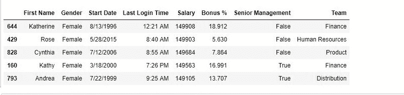

# Python | Pandas data frame . nlargetst()

> 原文:[https://www . geesforgeks . org/python-pandas-data frame-nlargest/](https://www.geeksforgeeks.org/python-pandas-dataframe-nlargest/)

Python 是进行数据分析的优秀语言，主要是因为以数据为中心的 python 包的奇妙生态系统。 ***【熊猫】*** 就是其中一个包，让导入和分析数据变得容易多了。

熊猫 **`nlargest()`** 方法用于从一个数据帧或一个序列中获取 n 个最大值。

**语法:**

```py
DataFrame.nlargest(n, columns, keep='first')
```

**参数:**

> **n:** int，要选择的值的数量
> **列:**列检查值，或者用户也可以在调用时选择列。[例如:数据[“年龄”]。非最小(3)或数据.非最小(3，“年龄”)]
> 
> **保留:**对象以设置在重复项退出时选择哪个值。选项是“第一”或“最后”

要下载使用的 CSV 文件，点击这里[。](https://media.geeksforgeeks.org/wp-content/uploads/employees.csv)

**代码#1:** 提取最大 5 个值
在本例中，提取最大 5 个值，然后与 sort_values()函数排序的其他值进行比较。在尝试此方法之前，会移除 NaN 值。

参考[排序 _ 值](https://www.geeksforgeeks.org/python-pandas-dataframe-sort_values-set-1/)和 [dropna()](https://www.geeksforgeeks.org/python-pandas-dataframe-dropna/) 功能。

```py
# importing pandas package
import pandas as pd

# making data frame from csv file
data = pd.read_csv("employees.csv")

# removing null values
data.dropna(inplace = True)

# extracting greatest 5
large5 = data.nlargest(5, "Salary")

# display
large5
```

**输出:**


**代码#2:** 按 sort_values()排序

```py
# importing pandas package
import pandas as pd

# making data frame from csv file 
data = pd.read_csv("employees.csv")

# removing null values
data.dropna(inplace = True)

# sorting in descending order
data.sort_values("Salary", ascending = False, inplace = True)

# displaying top 5 values
data.head()
```

**输出:**

如输出图像所示，两个函数返回的值相似。
