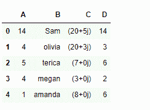
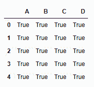
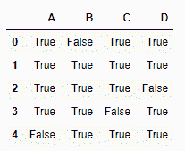

# python | pandas data frame . note null()

> 原文:[https://www . geesforgeks . org/python-pandas-data frame-not null/](https://www.geeksforgeeks.org/python-pandas-dataframe-notnull/)

Python 是进行数据分析的优秀语言，主要是因为以数据为中心的 python 包的奇妙生态系统。 ***【熊猫】*** 就是其中一个包，让导入和分析数据变得容易多了。
熊猫**数据框. notnull()** 功能检测数据框中存在/不缺失的值。该函数返回一个布尔对象，该对象的大小与应用它的对象的大小相同，指示每个单独的值是否为 na 值。所有非缺失值都被映射为 true，缺失值被映射为 false。
**注意:**空字符串”或 numpy.inf 等字符不视为 NA 值。(除非你设置 pandas . options . mode . use _ INF _ as _ na = True)。

> **语法:** DataFrame.notnull()
> **返回:**data frame 中每个元素的布尔值掩码，该掩码指示某个元素是否不是安娜值。

**示例#1:** 使用 notnull()函数查找数据帧中所有未缺失的值。

## 蟒蛇 3

```py
# importing pandas as pd
import pandas as pd

# Creating the first dataframe
df = pd.DataFrame({"A":[14, 4, 5, 4, 1],
                   "B":["Sam", "olivia", "terica", "megan", "amanda"],
                   "C":[20 + 5j, 20 + 3j, 7, 3, 8],
                   "D":[14, 3, 6, 2, 6]})

# Print the dataframe
df
```



让我们使用 dataframe.notnull()函数来查找 dataframe 中所有未丢失的值。

## 蟒蛇 3

```py
# find non-na values
df.notnull()
```

**输出:**



正如我们在输出中看到的，dataframe 中所有未丢失的值都被映射为 true。数据框

**中没有缺失值，因此没有错误值。示例#2:** 当数据框中有缺失值时，使用 notnull()函数来查找非缺失值。

## 蟒蛇 3

```py
# importing pandas as pd
import pandas as pd

# Creating the dataframe
df = pd.DataFrame({"A":["Sandy", "alex", "brook", "kelly", np.nan],
                   "B":[np.nan, "olivia", "terica", "", "amanda"],
                   "C":[20 + 5j, 20 + 3j, 7, None, 8],
                    "D":[14.8, 3, None, 2.3, 6]})

# find non-missing values
df.notnull()
```

**输出:**



请注意，空字符串也被映射为 true，表示它不是 NaN 值。