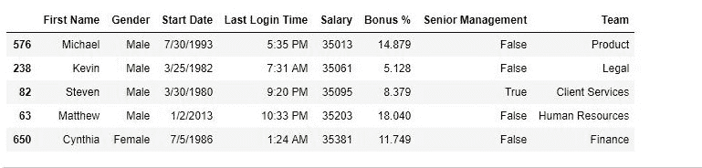

# Python | Pandas data frame . nsmalest()

> 原文:[https://www . geesforgeks . org/python-pandas-data frame-ns mallest/](https://www.geeksforgeeks.org/python-pandas-dataframe-nsmallest/)

Python 是进行数据分析的优秀语言，主要是因为以数据为中心的 python 包的奇妙生态系统。 ***【熊猫】*** 就是其中一个包，让导入和分析数据变得容易多了。
Pandas **nsmallest()** 方法用于从一个数据帧或一系列数据中获取 n 个最小值。

> **语法:**data frame . nsmalest(n，columns，keep='first')
> **参数:**
> **n:** int，数值个数选择
> **columns:** Column 检查数值最少或者用户也可以在调用时选择 Column。[例如:数据[“年龄”]。nsmallast(3)OR data . nsmallast(3，“年龄”)]
> **keep:** 对象设置在重复项退出时选择哪个值。选项是“第一个”或“最后一个”。

要下载使用的 CSV 文件，点击这里[。](https://media.geeksforgeeks.org/wp-content/uploads/employees.csv)
**示例#1:** 提取最少 5 个值
在此示例中，提取最少 5 个值，然后与 sort_values()函数排序的其他值进行比较。
在尝试此方法之前，会删除 NaN 值。
参考 [sort_values](https://www.geeksforgeeks.org/python-pandas-dataframe-sort_values-set-1/) 和 [dropna()](https://www.geeksforgeeks.org/python-pandas-dataframe-dropna/) 。

## 计算机编程语言

```py
# importing pandas package
import pandas as pd

# making data frame from csv file
data = pd.read_csv("employees.csv")

# removing null values
data.dropna(inplace = True)

# extracting least 5
least5 = data.nsmallest(5, "Salary")

# display
least5
```

**输出:**



**示例#2:** 按 sort_values()排序

## 计算机编程语言

```py
# importing pandas package
import pandas as pd

# making data frame from csv file
data = pd.read_csv("employees.csv")

# removing null values
data.dropna(inplace = True)

# sorting in ascending order
data.sort_values("Salary", ascending = True, inplace = True)

# displaying top 5 values
data.head()
```

**输出:**
如输出图像所示，两个函数返回的值相似。

