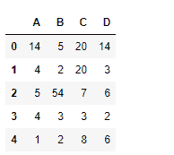
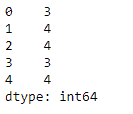
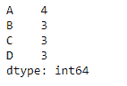

# python | pandas data frame . nuneme()

> 哎哎哎:# t0]https://www . geeksforgeeks . org/python 熊猫 data frame-nuneme/

Python 是进行数据分析的优秀语言，主要是因为以数据为中心的 python 包的奇妙生态系统。 ***【熊猫】*** 就是其中一个包，让导入和分析数据变得容易多了。

熊猫 `**dataframe.nunique()**`函数返回一系列在请求轴上的不同观测值。如果我们将轴的值设置为 0，那么它会找到索引轴上唯一观测值的总数。如果我们将轴的值设置为 1，那么它会找到列轴上唯一观测值的总数。它还提供了从唯一数字计数中排除`NaN`值的功能。

> **语法:**data frame . never(axis = 0，dropna=True)
> 
> **参数:**
> **轴:** {0 或‘索引’，1 或‘列’}，默认 0
> **dropna :** 计数中不包含 NaN。
> 
> **返回:**努尼克:系列

**示例#1:** 使用`nunique()`函数查找列轴上唯一值的数量。

```
# importing pandas as pd
import pandas as pd

# Creating the first dataframe 
df = pd.DataFrame({"A":[14, 4, 5, 4, 1],
                   "B":[5, 2, 54, 3, 2],
                   "C":[20, 20, 7, 3, 8],
                    "D":[14, 3, 6, 2, 6]})

# Print the dataframe
df
```



让我们使用`dataframe.nunique()`函数来查找列轴上的唯一值。

```
# find unique values
df.nunique(axis = 1)
```

**输出:**

正如我们在输出中看到的，该函数打印每行中唯一值的总数。

**示例 2:** 使用`nunique()`函数查找数据帧中索引轴上唯一值的数量。数据框包含`NaN`值。

```
# importing pandas as pd
import pandas as pd

# Creating the first dataframe 
df = pd.DataFrame({"A":["Sandy", "alex", "brook", "kelly", np.nan],
                   "B":[np.nan, "olivia", "olivia", "", "amanda"], 
                   "C":[20 + 5j, 20 + 5j, 7, None, 8],
                   "D":[14.8, 3, None, 6, 6]})

# apply the nunique() function
df.nunique(axis = 0, dropna = True)
```

**输出:**

该函数将空字符串视为第 2 列中的唯一值。