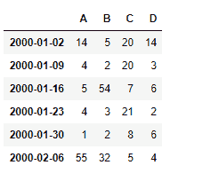
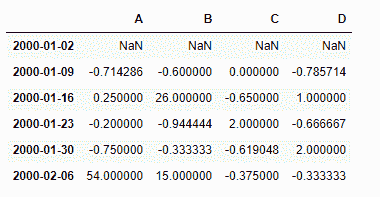
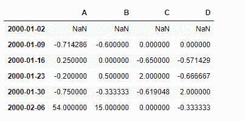

# Python | Pandas data frame . pct _ change()

> 原文:[https://www . geesforgeks . org/python-pandas-data frame-pct _ change/](https://www.geeksforgeeks.org/python-pandas-dataframe-pct_change/)

Python 是进行数据分析的优秀语言，主要是因为以数据为中心的 python 包的奇妙生态系统。 ***【熊猫】*** 就是其中一个包，让导入和分析数据变得容易多了。

熊猫 `**dataframe.pct_change()**`函数计算当前元素和先前元素之间的百分比变化。默认情况下，此函数计算前一行的百分比变化。

**注:**该函数在时间序列数据中最有用。

> **语法:**data frame . pct _ change(periods = 1，fill_method='pad '，limit=None，freq=None，**kwargs)
> 
> **参数:**
> **周期:**周期移位形成百分比变化。
> **fill_method :** 如何在计算百分比变化之前处理 NAs。
> **限制:**停止前要填充的连续 NAs 数量
> **freq :** 从时间序列 API(如‘M’或 BDay())开始递增使用。
> ****kwargs :** 其他关键字参数被传递到 DataFrame.shift 或 Series.shift 中。
> 
> **返回:**与调用对象相同的类型。

**示例#1:** 使用`pct_change()`函数查找时间序列数据中的百分比变化。

```
# importing pandas as pd
import pandas as pd

# Creating the time-series index
ind = pd.date_range('01/01/2000', periods = 6, freq ='W')

# Creating the dataframe 
df = pd.DataFrame({"A":[14, 4, 5, 4, 1, 55],
                   "B":[5, 2, 54, 3, 2, 32], 
                   "C":[20, 20, 7, 21, 8, 5],
                   "D":[14, 3, 6, 2, 6, 4]}, index = ind)

# Print the dataframe
df
```



让我们使用`dataframe.pct_change()`函数来查找数据中的百分比变化。

```
# find the percentage change with the previous row
df.pct_change()
```

**输出:**

第一行包含`NaN`值，因为没有前一行可以计算变化。

**示例#2:** 使用`pct_change()`函数查找也具有`NaN`值的数据中的百分比变化。

```
# importing pandas as pd
import pandas as pd

# Creating the time-series index
ind = pd.date_range('01/01/2000', periods = 6, freq ='W')

# Creating the dataframe 
df = pd.DataFrame({"A":[14, 4, 5, 4, 1, 55],
                   "B":[5, 2, None, 3, 2, 32], 
                   "C":[20, 20, 7, 21, 8, None],
                   "D":[14, None, 6, 2, 6, 4]}, index = ind)

# apply the pct_change() method
# we use the forward fill method to
# fill the missing values in the dataframe
df.pct_change(fill_method ='ffill')
```

**输出:**


第一行包含`NaN`值，因为没有我们可以从中计算变化的前一行。数据框中的所有`NaN`值都已使用`ffill`方法填充。