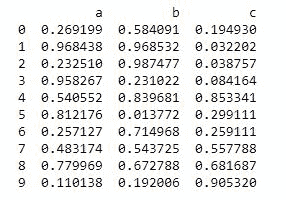
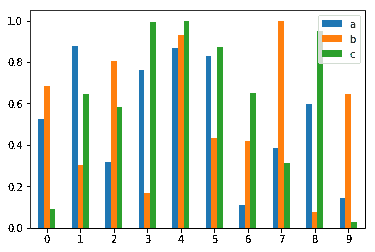
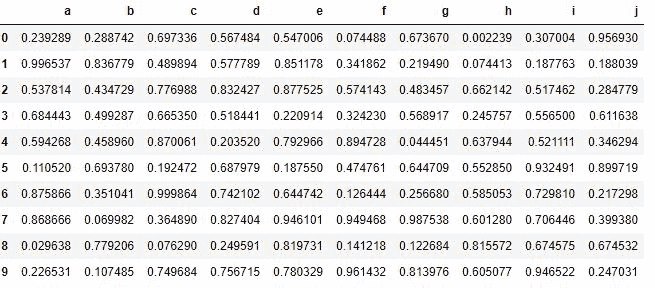
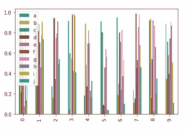

# Python | Pandas data frame . plot . bar

> 原文:[https://www . geesforgeks . org/python-pandas-data frame-plot-bar/](https://www.geeksforgeeks.org/python-pandas-dataframe-plot-bar/)

Python 是进行数据分析的优秀语言，主要是因为以数据为中心的 python 包的奇妙生态系统。 ***【熊猫】*** 就是其中一个包，让导入和分析数据变得容易多了。

熊猫`**DataFrame.plot.bar()**`以矩形条的形式垂直绘制图形。

> **语法:**data frame . plot . bar(x =无，y =无，**kwds)
> 
> **参数:**
> **x :** (标签或位置，可选)允许绘制一列与另一列的对比。如果未指定，则使用数据框的索引。
> **y :** (标签或位置，可选)允许绘制一列与另一列的对比。如果未指定，则使用所有数字列。
> ****kwds :** 附加关键字参数
> 
> **返回:** matplotlib.axes.Axes 或它们的 NP . n 数组

**示例#1:** 使用`DataFrame.plot.bar()`以矩形条的形式垂直绘制图形

```
# importing matplotlib
import matplotlib.pyplot

# importing pandas as pd
import pandas as pd

# importing numpy as np
import numpy as np

# creating a dataframe 
df = pd.DataFrame(np.random.rand(10, 3), columns =['a', 'b', 'c'])

print(df)
```


现在我们将使用函数`DataFrame.plot.bar()`以矩形条的形式垂直绘制图形

```
# using a function df.plot.bar()
df.plot.bar()
```

**输出:**


**示例 2:** 使用`DataFrame.plot.bar()`以矩形条的形式垂直绘制图形。

```
# importing matplotlib
import matplotlib.pyplot

# importing pandas as pd
import pandas as pd

# importing numpy as np
import numpy as np

# creating a dataframe
df = pd.DataFrame(np.random.rand(10, 10),
                  columns =['a', 'b', 'c', 'd', 'e', 'f', 'g', 'h', 'i', 'j'])

df
```


现在我们将使用函数`DataFrame.plot.bar()`以矩形条的形式垂直绘制图形

```
# using a function df.plot.bar()
df.plot.bar()
```

**输出:**
