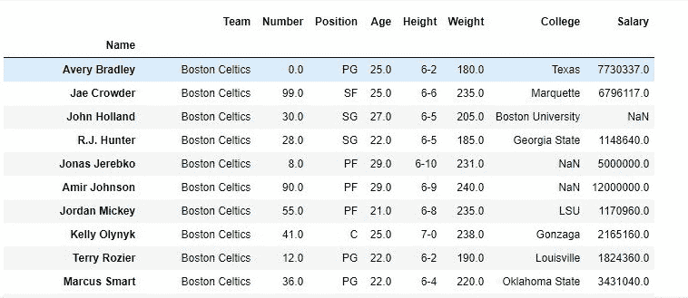
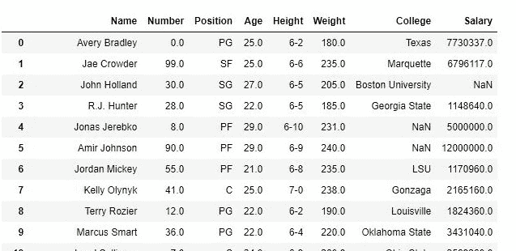
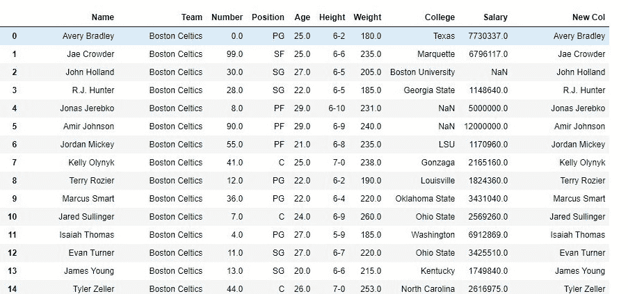

# python | pandas data frame . pop()

> 原文:[https://www.geeksforgeeks.org/python-pandas-dataframe-pop/](https://www.geeksforgeeks.org/python-pandas-dataframe-pop/)

Python 是进行数据分析的优秀语言，主要是因为以数据为中心的 python 包的奇妙生态系统。 ***【熊猫】*** 就是其中一个包，让导入和分析数据变得容易多了。

熊猫 **`Pop()`** 方法在大部分数据结构中都很常见，但 *pop()* 方法与其他方法略有不同。在堆栈中，pop 不需要任何参数，每次都会弹出最后一个元素。但是 pandas pop 方法可以从数据框中输入一列，然后直接弹出。

> **语法:** DataFrame.pop(项目)
> 
> **参数:**
> **项目:**要以字符串形式弹出的列名
> 
> **返回类型:**以熊猫系列形式弹出的列

要下载代码中使用的 CSV，点击这里的[。](https://media.geeksforgeeks.org/wp-content/uploads/nba.csv)

**示例#1:**
在本例中，函数弹出并返回了一列。然后将新的数据帧与旧的数据帧进行比较。

```
import pandas as pd
# importing pandas package

data = pd.read_csv("nba.csv")
# making data frame from csv file

popped_col = data.pop("Team")
# storing data in new var

data
# display
```

**输出:**
在输出图像中，使用前后的数据帧进行比较。pop()。如第二张图片所示，团队列已经弹出。

**使用前的数据框。pop()**


**data frame 使用后。pop()**


**示例#2:** 在其他数据帧
中 pop 和 push 在此示例中，制作数据帧的副本，并将弹出的列插入到其他数据帧的末尾。

```
import pandas as pd
# importing pandas package

data = pd.read_csv("nba.csv")
# making data frame from csv file

new = data.copy()
# creating independent copy of data frame

popped_col = data.pop("Name")
# storing data in new var

new["New Col"]= popped_col
# creating new col and passing popped col

new
# display
```

**输出:**
如输出图像所示，新的数据帧在末尾有 new 列，它只不过是前面弹出的 Name 列。
